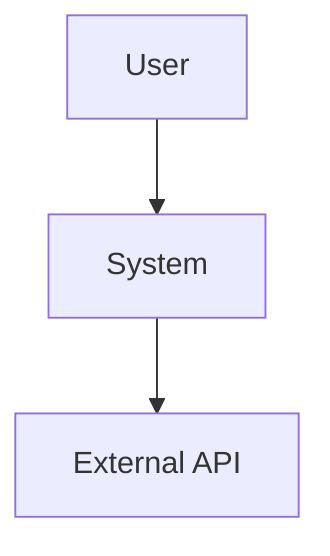
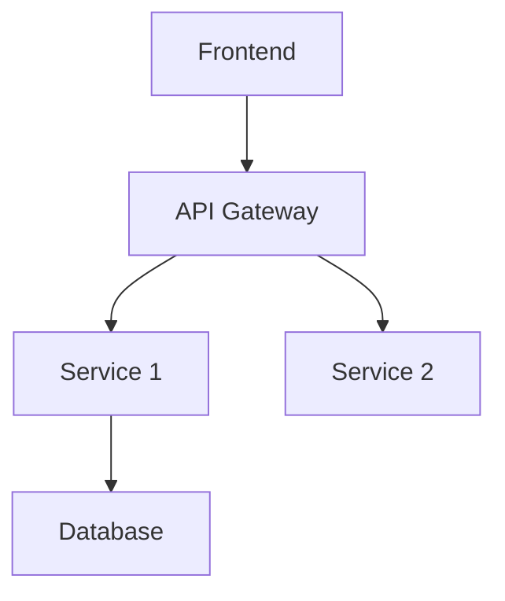
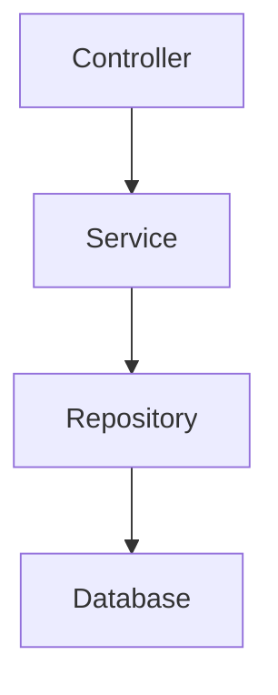

# Plan Architectural — {{FEATURE_NAME}}

**Date** : {{DATE}}  
**Auteur** : {{AGENT_ID}}  
**Ticket** : {{TICKET_ID}}  
**Statut** : 🟡 Draft | 🟢 Validé | 🔴 Rejeté

---

## 1. Contexte

### Problème à résoudre
<!-- Décris le problème ou le besoin en 2-3 phrases -->

### Objectifs
<!-- Liste les objectifs mesurables -->
- [ ] Objectif 1
- [ ] Objectif 2
- [ ] Objectif 3

### Contraintes
<!-- Liste les contraintes techniques, temporelles, budgétaires -->
- Contrainte 1
- Contrainte 2

---

## 2. Analyse de l'Existant

### Composants Impactés
<!-- Liste les composants/modules qui seront modifiés -->
- `path/to/component1.ts` : Description de l'impact
- `path/to/component2.ts` : Description de l'impact

### Dépendances
<!-- Graphe de dépendances ou liste -->
```
ComponentA → ComponentB → ComponentC
     ↓
ComponentD
```

### Patterns Existants
<!-- Patterns architecturaux déjà utilisés dans le projet -->
- Pattern 1 : Description
- Pattern 2 : Description

---

## 3. Solution Proposée

### Vue d'Ensemble
<!-- Description générale de la solution en 1 paragraphe -->

### Architecture

#### Diagramme C4 - Contexte


#### Diagramme C4 - Conteneurs


#### Diagramme C4 - Composants


### Flux de Données
<!-- Décris le flux de données principal -->
1. Étape 1 : Description
2. Étape 2 : Description
3. Étape 3 : Description

### Modèle de Données
<!-- Schéma des entités et relations -->
```typescript
interface Entity {
  id: string;
  name: string;
  // ...
}
```

---

## 4. Découpage en Micro-Tâches

### Phase 1 : Préparation
- [ ] **Tâche 1.1** : Créer les interfaces/types
  - Fichiers : `types/entity.ts`
  - Estimation : 30 lignes
  - Tests : types.test.ts

- [ ] **Tâche 1.2** : Mettre en place le repository
  - Fichiers : `repositories/entity.repository.ts`
  - Estimation : 80 lignes
  - Tests : entity.repository.test.ts

### Phase 2 : Implémentation
- [ ] **Tâche 2.1** : Implémenter le service métier
  - Fichiers : `services/entity.service.ts`
  - Estimation : 100 lignes
  - Tests : entity.service.test.ts

- [ ] **Tâche 2.2** : Créer le controller/handler
  - Fichiers : `controllers/entity.controller.ts`
  - Estimation : 60 lignes
  - Tests : entity.controller.test.ts

### Phase 3 : Intégration
- [ ] **Tâche 3.1** : Intégrer avec l'API Gateway
  - Fichiers : `routes/entity.routes.ts`
  - Estimation : 40 lignes
  - Tests : entity.routes.test.ts

- [ ] **Tâche 3.2** : Tests E2E
  - Fichiers : `tests/e2e/entity.e2e.test.ts`
  - Estimation : 100 lignes

### Phase 4 : Documentation
- [ ] **Tâche 4.1** : Documentation API (OpenAPI)
  - Fichiers : `specs/entity-api.yaml`
  
- [ ] **Tâche 4.2** : Mise à jour du README
  - Fichiers : `README.md`

---

## 5. Risques et Mitigations

| Risque                   | Probabilité | Impact | Mitigation                      |
| ------------------------ | ----------- | ------ | ------------------------------- |
| Performance dégradée     | Moyenne     | Élevé  | Ajouter des indices DB, caching |
| Régression sur feature X | Faible      | Élevé  | Tests E2E complets              |
| Complexité accrue        | Élevée      | Moyen  | Refactoring progressif          |

---

## 6. Critères de Validation

### Tests
- [ ] Couverture ≥ 80%
- [ ] Score de mutation ≥ 70%
- [ ] Tous les tests E2E passent

### Performance
- [ ] Temps de réponse < 200ms (p95)
- [ ] Pas de fuite mémoire
- [ ] Charge supportée : 1000 req/s

### Sécurité
- [ ] Aucune vulnérabilité high/critical
- [ ] Validation des entrées
- [ ] Authentification/autorisation

### Documentation
- [ ] API documentée (OpenAPI)
- [ ] README à jour
- [ ] ADR créé si nécessaire

---

## 7. Alternatives Considérées

### Alternative 1 : {{NOM}}
**Description** : ...  
**Avantages** : ...  
**Inconvénients** : ...  
**Raison du rejet** : ...

### Alternative 2 : {{NOM}}
**Description** : ...  
**Avantages** : ...  
**Inconvénients** : ...  
**Raison du rejet** : ...

---

## 8. Décisions Architecturales

### Décision 1 : {{TITRE}}
- **Contexte** : ...
- **Décision** : ...
- **Conséquences** : ...

### Décision 2 : {{TITRE}}
- **Contexte** : ...
- **Décision** : ...
- **Conséquences** : ...

---

## 9. Timeline

| Phase     | Durée Estimée | Dépendances |
| --------- | ------------- | ----------- |
| Phase 1   | 2h            | -           |
| Phase 2   | 4h            | Phase 1     |
| Phase 3   | 3h            | Phase 2     |
| Phase 4   | 1h            | Phase 3     |
| **Total** | **10h**       |             |

---

## 10. Validation

### Revue Technique
- [ ] Revue par {{REVIEWER_1}}
- [ ] Revue par {{REVIEWER_2}}

### Approbation
- [ ] Product Owner
- [ ] Tech Lead
- [ ] Security Team (si nécessaire)

---

## Annexes

### Références
- [Lien vers la spec](...)
- [Lien vers le ticket](...)
- [Documentation externe](...)

### Prototypes
- [Lien vers le prototype](...)
- [Lien vers le POC](...)

---

**Statut Final** : {{STATUT}}  
**Date de Validation** : {{DATE_VALIDATION}}
