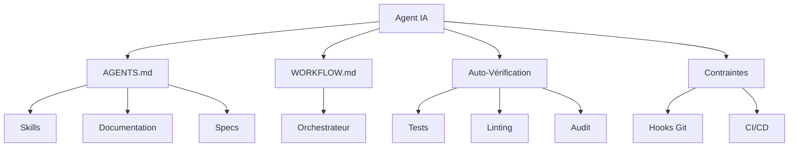

# Architecture — Axiom-Scaffold

## Vue d'Ensemble

Axiom-Scaffold est construit sur une architecture en 9 couches, chacune ayant une responsabilité claire et des interfaces bien définies.

## Couche 0 — Harness Engineering (Implémentée)

### Responsabilité
Fournir l'environnement, les règles, les automatismes et la structure de connaissance pour que les agents IA puissent travailler de manière fiable et autonome.

### Composants

#### 1. Scripts de Bootstrap
- `script/bootstrap.sh` : Installation globale des outils
- `script/setup.sh` : Initialisation d'un projet
- `script/after-agent.sh` : Post-traitement
- `script/on-error.sh` : Gestion d'erreur

#### 2. Base de Connaissance
- `AGENTS.md` : Carte de navigation (≈100 lignes)
- `WORKFLOW.md` : Contrat d'orchestration
- `docs/` : Documentation technique
- `specs/` : Spécifications

#### 3. Skills
- Registre : `skills/registry.json`
- Skills locaux : `skills/`
- Skills globaux : `~/.axiom/skills/`
- Activation dynamique selon mots-clés

#### 4. Auto-Vérification
- Tests unitaires (Jest)
- Tests de mutation (Stryker)
- Tests E2E (Playwright)
- Linting (ESLint, MarkdownLint)
- Audit de sécurité (npm audit)

#### 5. Contraintes Mécaniques
- Hooks Git (Husky)
- Pipeline CI/CD (GitHub Actions)
- Règles de linting strictes
- Seuils de qualité

### Diagramme



## Couches Futures

### Couche 1 — Mémoire
- Mémoire chaude (contexte actif)
- Mémoire froide (Obsidian, Pinecone)
- Graphe de connaissances (GitNexus)

### Couche 2 — Spécifications
- Constitution du projet
- Specs techniques
- ADR (Architecture Decision Records)

### Couche 3 — Minimiseur
- Compression du contexte
- Extraction de sous-graphes
- Limite de 500 tokens par tâche

### Couche 4 — Design
- Design system
- Tokens de design
- Génération de maquettes

### Couche 5 — Exécution
- Orchestration des tâches
- Découpage en micro-tâches
- Validation incrémentale

### Couche 6 — Visualisation
- Graphes de dépendances
- Diagrammes d'architecture
- Preuves visuelles (Playwright)

### Couche 7 — Apprentissage
- Détection de patterns
- Mise à jour de la base de connaissance
- Amélioration continue

### Couche 8 — Sécurité
- Détection de secrets
- Analyse de vulnérabilités
- Threat modeling

## Principes Architecturaux

### 1. Séparation des Responsabilités
Chaque couche a une responsabilité unique et bien définie.

### 2. Interfaces Claires
Les couches communiquent via des interfaces standardisées (fichiers Markdown, JSON, YAML).

### 3. Déterminisme
Les opérations doivent être reproductibles et prévisibles.

### 4. Zero-Trust
Aucune confiance implicite, validation à chaque étape.

### 5. Minimalisme
Pas de complexité inutile, simplicité avant optimisation.

## Flux de Travail

### 1. Initialisation
```
Développeur → bootstrap.sh → Environnement global
Développeur → setup.sh → Projet initialisé
```

### 2. Exécution d'une Tâche
```
Ticket → Orchestrateur → Agent IA
Agent → AGENTS.md → Navigation
Agent → Skills → Compétences
Agent → Implémentation → Micro-tâches
Agent → Auto-vérification → Tests
Agent → Commit → Hooks Git
Commit → CI/CD → Validation
```

### 3. Post-Traitement
```
Agent terminé → after-agent.sh
→ Logs capturés
→ GitNexus ré-indexé
→ Obsidian mis à jour
→ Preuve Playwright uploadée
→ Ticket mis à jour
```

## Décisions Architecturales

### ADR-001 : Markdown comme Format Principal
**Contexte** : Besoin d'un format lisible par les humains et les agents.  
**Décision** : Utiliser Markdown pour toute la documentation.  
**Conséquences** : Facilite la lecture et l'édition, mais nécessite des parsers.

### ADR-002 : Skills Chargés Dynamiquement
**Contexte** : Éviter de surcharger le contexte de l'agent.  
**Décision** : Charger les skills à la demande selon les mots-clés.  
**Conséquences** : Contexte minimal, mais nécessite un registre bien maintenu.

### ADR-003 : Hooks Git pour Contraintes
**Contexte** : Besoin de garantir la qualité avant commit.  
**Décision** : Utiliser Husky pour les hooks Git.  
**Conséquences** : Validation automatique, mais peut ralentir les commits.

### ADR-004 : Micro-Tâches ≤ 100 Lignes
**Contexte** : Limiter la complexité et faciliter la validation.  
**Décision** : Découper toute tâche en micro-tâches de ≤ 100 lignes.  
**Conséquences** : Validation incrémentale, mais plus de commits.

## Métriques

### Qualité
- Couverture de tests : ≥ 80%
- Score de mutation : ≥ 70%
- Complexité cyclomatique : ≤ 10

### Performance
- Temps de bootstrap : < 5 minutes
- Temps de setup : < 2 minutes
- Temps de CI : < 10 minutes

### Sécurité
- Aucune vulnérabilité high/critical
- Secrets détectés : 0
- Audit passé : 100%

## Évolution

### Version 1.0 (Actuelle)
- ✅ Couche 0 complète
- ✅ 12 skills disponibles
- ✅ Auto-vérification fonctionnelle
- ✅ CI/CD opérationnelle

### Version 1.1 (Prochaine)
- ⏳ Couche 1 (Mémoire)
- ⏳ Intégration GitNexus complète
- ⏳ Synchronisation Obsidian

### Version 2.0 (Future)
- ⏳ Couches 2-8
- ⏳ Orchestration complète
- ⏳ Apprentissage automatique

---

**Dernière mise à jour** : 2026-05-07  
**Version** : 1.0.0
