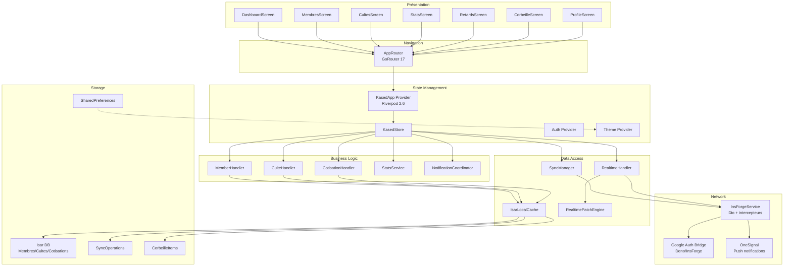
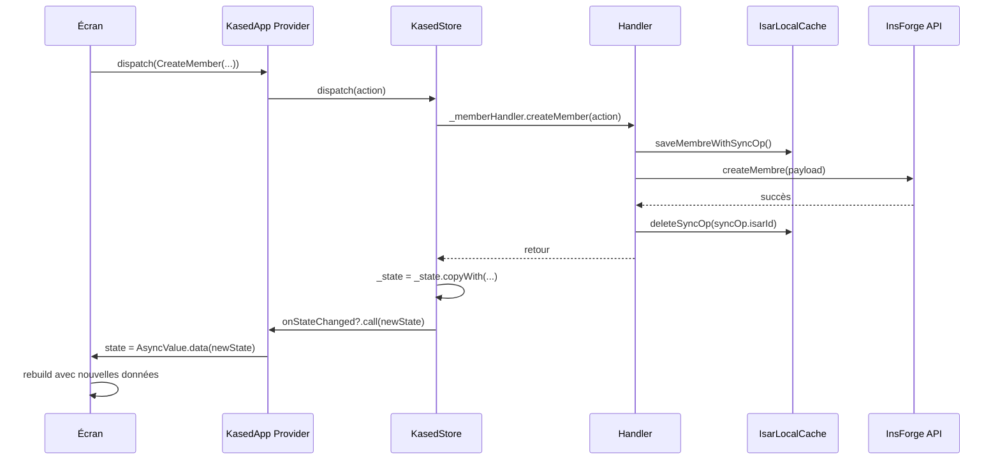
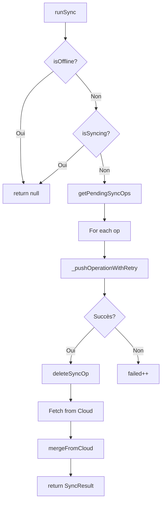
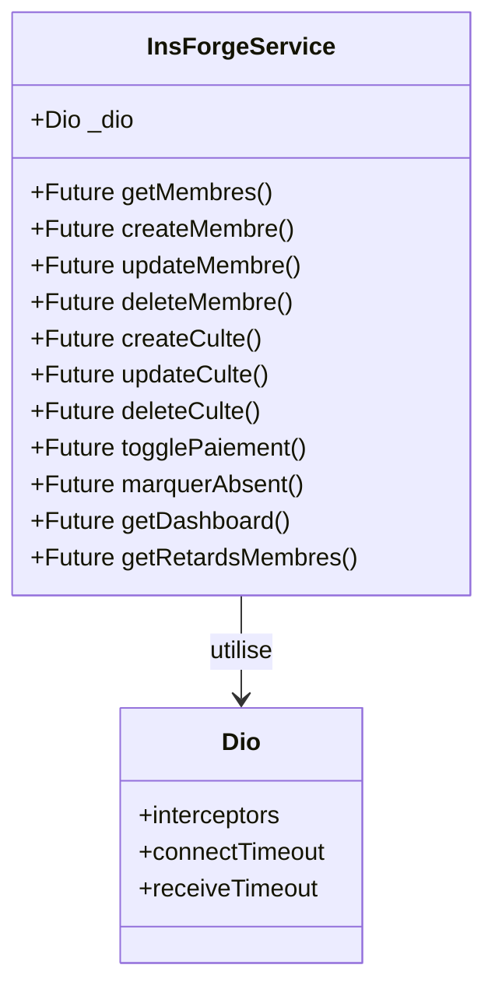
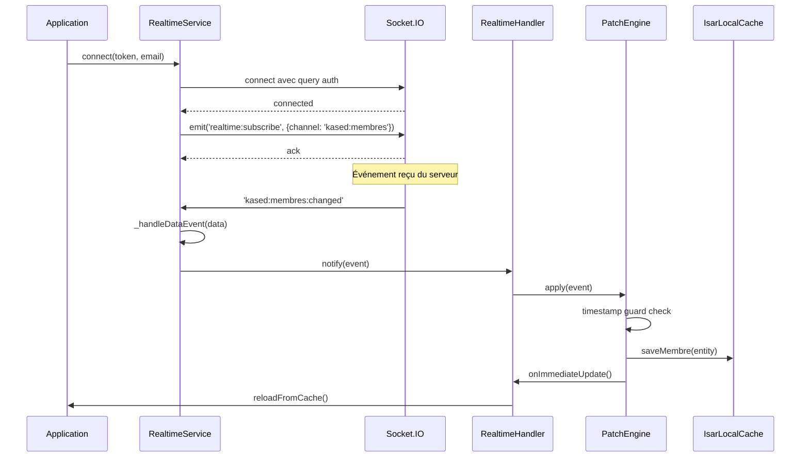

# Architecture

Vue d'ensemble technique de l'architecture Kased App.

## Aperçu Global



## Couche 1 — Présentation (Screens & Widgets)

**Nombre de fichiers :** ~45 fichiers Dart

### Écrans Principaux

| Écran | Route | Fichier | Responsabilité |
|-------|-------|---------|----------------|
| Dashboard | `/dashboard` | `lib/screens/dashboard/dashboard_screen.dart` | Vue d'ensemble, stats |
| Membres | `/membres` | `lib/screens/membres/membres_screen.dart` | Liste, ajout, recherche |
| Cultes | `/cultes` | `lib/screens/cultes/cultes_screen.dart` | Liste cultes, saisie cotisations |
| Stats | `/stats` | `lib/screens/stats/stats_screen.dart` | Graphiques financiers |
| Retards | `/retards` | `lib/screens/retards/retards_screen.dart` | Membres en retard |
| Corbeille | `/corbeille` | `lib/screens/corbeille/corbeille_screen.dart` | Éléments supprimés |
| Profile | `/profile` | `lib/screens/profile/profile_screen.dart` | Paramètres utilisateur |

### Widgets Réutilisables

```dart
// lib/widgets/
KasedCard          // Carte générique avec ombre premium
KasedAvatar        // Avatar avec initiales
StatCard           // Carte statistique
EmptyState         // État vide avec illustration
SkeletonLoading    // Skeleton shimmer (3s cycle)
SpringButton       // Bouton avec animation spring
SpringNavIcon      // Icône de navigation animée
```

**Pourquoi ce pattern ?** Les écrans sont fins et délèguent toute la logique au `KasedStore`. Cela permet de tester la logique métier indépendamment de l'UI.

## Couche 2 — State Management (Riverpod)

**Fichier principal :** `lib/providers/kased_app_provider.dart`



### KasedStore — Le Cœur du Système

**Fichier :** `lib/store/kased_store.dart`

```dart
class KasedStore {
  AppState _state = AppState();
  AppState get state => _state;

  // Dépendances
  final LocalCache cache;
  final InsForgeServicePort api;
  final SyncService syncService;
  final StatsService statsService;
  final NotificationCoordinator notifCoordinator;

  // Callback UI
  void Function(AppState newState)? onStateChanged;

  // Actions principales
  Future<void> dispatch(KasedAction action) async {
    switch (action) {
      case CreateMember():
        await _memberHandler.createMember(action);
        final membres = await cache.getAllMembres();
        _state = _state.copyWith(membres: sortMembres(membres));
        onStateChanged?.call(_state);
      // ... autres actions
    }
  }
}
```

**Design decision :** Le store utilise un callback `onStateChanged` au lieu de setState car Riverpod gère déjà la réactivité. Cela évite les double-rebuilds.

## Couche 3 — Business Logic (Handlers)

**Fichier :** `lib/store/handlers/member_handler.dart`

Chaque handler est une classe stateless qui encapsule la logique métier d'un domaine :

| Handler | Fichier | Actions |
|---------|---------|---------|
| `MemberHandler` | `member_handler.dart` | createMember, updateMember, deleteMember, addPaymentAdvance |
| `CulteHandler` | `culte_handler.dart` | createCulte, updateCulte, deleteCulte, restoreCulte |
| `CotisationHandler` | `cotisation_handler.dart` | registerPayment, markAbsent, bulkSetPaiements, togglePaiement |

### Pattern Handler

```dart
class MemberHandler {
  final LocalCache cache;
  final InsForgeServicePort api;
  final DeviceServicePort deviceService;
  final NotificationCoordinator notifCoordinator;
  final Future<void> Function() onLoadDashboard;
  final Future<void> Function(String event, String label, {String? extra}) onPush;

  Future<void> createMember(CreateMember action) async {
    // 1. Générer UUID
    final newMembre = Membre()..id = UuidUtils.generate()...;

    // 2. Créer SyncOperation
    final syncOp = SyncOperation()...;

    // 3. Sauvegarder localement (Isar + op sync)
    await cache.saveMembreWithSyncOp(newMembre, syncOp);

    // 4. Appeler API (avec gestion d'erreur)
    try {
      await api.createMembre(newMembre.toJson());
      await cache.deleteSyncOp(syncOp.isarId); // Bug fix: supprimer l'op si succès
    } catch (e) {
      debugPrint('[MemberHandler] createMembre réseau échoué: $e');
      // L'op reste en file pour le prochain sync
    }

    // 5. Notifications
    notifCoordinator.notifierCreationMembreFull(newMembre);
    unawaited(onPush('membre_ajoute', newMembre.nomComplet));
  }
}
```

## Couche 4 — Data Access (Cache & Sync)

### IsarLocalCache

**Fichier :** `lib/core/isar_local_cache.dart`

Implémentation de l'interface `LocalCache` (définie dans `lib/core/local_cache.dart`).

```dart
class IsarLocalCache implements LocalCache {
  final Isar _isar;

  @override
  Future<void> saveMembre(Membre m) => _isar.writeTxn(() async {
        // Delete first to prevent duplicates
        await _isar.membres.filter().idEqualTo(m.id).deleteAll();
        await _isar.membres.put(m);
      });

  @override
  Future<void> mergeFromCloud({...}) => _isar.writeTxn(() async {
        // Pour chaque entité, comparer updatedAt et garder le plus récent
        // Protéger les entités avec ops en attente
      });
}
```

### SyncManager

**Fichier :** `lib/core/sync/sync_manager.dart`



**Retry exponentiel :** 1s → 2s → 4s → 8s → 16s (max 5 tentatives)

## Couche 5 — Network (InsForgeService)

**Fichier :** `lib/core/insforge/insforge_service.dart`



**Intercepteurs :**
1. **LogInterceptor** (debug only) — logs des requêtes/réponses
2. **AuthInterceptor** — gère les 401 avec refresh token

## Couche 6 — Temps Réel (Socket.IO)

**Fichier :** `lib/core/realtime/realtime_service.dart`



## Décisions Architecturales Clés

### 1. Offline-First avec Isar

**Pourquoi :** Les églises ont souvent une connexion internet limitée. L'app doit fonctionner 100% offline.

**Comment :** Isar est la source de vérité locale. Les opérations sont bufferisées dans `SyncOperation` et poussées quand le réseau revient.

### 2. Actions Sealed Classes

**Pourquoi :** Typage exhaustif — le compiler Dart garantit que tous les cas sont traités dans le `switch`.

```dart
sealed class KasedAction {}
sealed class MemberAction extends KasedAction {}
class CreateMember extends MemberAction { ... }
// Si on oublie un case dans le switch, erreur de compilation
```

### 3. Pattern Handler

**Pourquoi :** Séparer la logique métier de l'état et de l'UI. Chaque handler est testable unitairement sans Flutter.

### 4. Realtime + Local Patch

**Pourquoi :** Éviter les reloads complets qui coûtent cher en bande passante. Les patchs locaux sont immédiats (UI update) puis un reload différé (30s) synchronise l'état complet.

### 5. Timestamp Guard

**Pourquoi :** Éviter les régressions quand deux appareils modifient la même entité simultanément. On garde toujours la version la plus récente.

## Métriques du Projet

| Métrique | Valeur |
|----------|--------|
| Fichiers Dart | 129 |
| Modèles Isar | 5 |
| Providers Riverpod | 8 |
| Écrans | 14 |
| Actions (sealed) | 25+ |
| Routes GoRouter | 15+ |
| Handlers métier | 3 |
| Services | 8 |

## Voir Aussi

- [Data Models](Data-Models) — Schéma complet des entités
- [State Management](State-Management) — Détails du store
- [Offline-First Sync](Offline-First-Sync) — Algorithme de merge
- [Realtime System](Realtime-System) — WebSocket et patch engine
