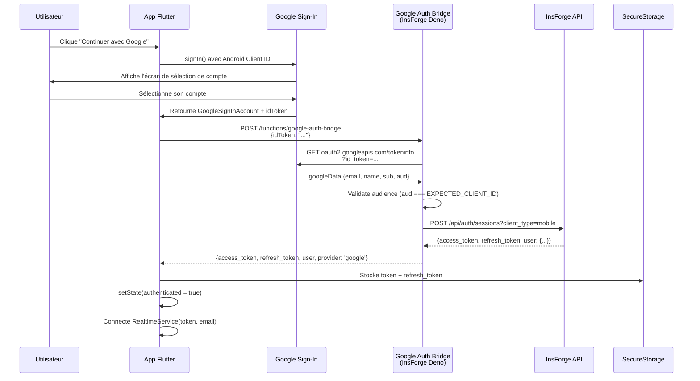
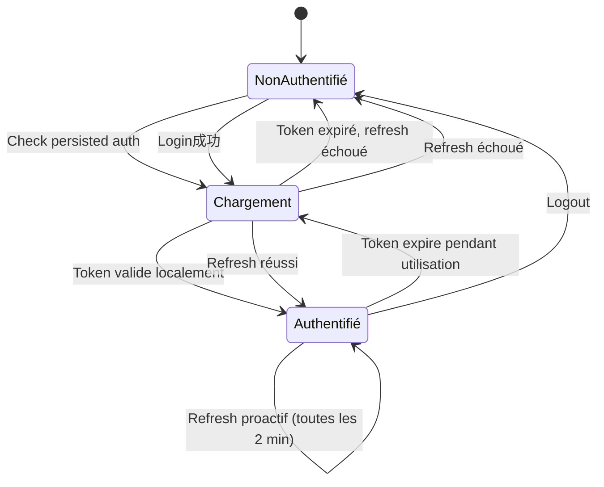

# Authentication

Système d'authentification de Kased App.

## Architecture d'Authentification



## Google Auth Bridge (v7)

**Fichier source :** `functions/google-auth-bridge.js`

Le bridge est une fonction serveur InsForge (Deno) qui sert d'intermédiaire entre Google Sign-In et InsForge.

```javascript
/**
 * Google Auth Bridge for KASED-APP (v7)
 * 
 * Features:
 * - Audience validation (Android Client ID)
 * - Provider tracking (google vs email)
 * - Salted internal password
 * - Automatic Profile creation
 */

const EXPECTED_CLIENT_ID = '535496831713-eqn2k8iasrmbfuk7r91nn43bnoenkma7.apps.googleusercontent.com';
const INTERNAL_SALT = 'KASED_SECURE_SALT_2026_v1';

module.exports = async function(request) {
  const body = await request.json();
  const idToken = body.idToken;

  // 1. Valider le token Google
  const googleRes = await fetch(`https://oauth2.googleapis.com/tokeninfo?id_token=${idToken}`);
  if (!googleRes.ok) {
    return new Response(JSON.stringify({ error: 'Invalid authentication source' }), {
      status: 401,
      headers: { 'Content-Type': 'application/json' }
    });
  }

  const googleData = await googleRes.json();

  // 2. Security Check: Audience validation
  if (googleData.aud !== EXPECTED_CLIENT_ID) {
    console.error(`Security Alert: Audience mismatch. Expected: ${EXPECTED_CLIENT_ID}, Got: ${googleData.aud}`);
    return new Response(JSON.stringify({ error: 'Security validation failed' }), {
      status: 403,
      headers: { 'Content-Type': 'application/json' }
    });
  }

  const email = googleData.email;
  const name = googleData.name || 'Utilisateur Google';
  const googleId = googleData.sub;
  const password = `GAuth_${googleId}_${INTERNAL_SALT.substring(0, 8)}`;

  // 3. Login or Signup avec provider: 'google'
  let authData;
  const loginRes = await fetch(`${baseUrl}/api/auth/sessions?client_type=mobile`, {
    method: 'POST',
    headers: bridgeHeaders,
    body: JSON.stringify({
      email,
      password,
      provider: 'google',
      app_metadata: {
        google_id: googleId,
        name: name
      }
    })
  });

  if (loginRes.ok) {
    authData = await loginRes.json();
  } else if (loginRes.status === 401) {
    // User not found — create account with provider: google
    const signUpRes = await fetch(`${baseUrl}/api/auth/users?client_type=mobile`, {
      method: 'POST',
      headers: bridgeHeaders,
      body: JSON.stringify({
        email,
        password,
        name,
        provider: 'google',
        app_metadata: {
          google_id: googleId,
          picture: googleData.picture
        }
      })
    });
    // ...
  }

  // 4. Profile Management (Upsert)
  await fetch(`${baseUrl}/api/database/records/profiles`, {
    method: 'POST',
    headers: {
      'Content-Type': 'application/json',
      'Authorization': `Bearer ${accessToken}`,
      'apikey': accessToken,
      'Prefer': 'resolution=merge-duplicates'
    },
    body: JSON.stringify([{
      id: userId,
      email: email,
      provider: 'google',
      google_id: googleId
    }]),
  });

  return new Response(JSON.stringify({
    ...authData,
    role: 'authenticated',
    provider: 'google',
    source: 'google-bridge-v7'
  }), {
    status: 200,
    headers: { 'Content-Type': 'application/json' }
  });
};
```

### Security Check — Audience Validation

**Pourquoi :** Empêcher l'utilisation d'un token Google généré pour une autre application.

```javascript
if (googleData.aud !== EXPECTED_CLIENT_ID) {
  return new Response(JSON.stringify({ error: 'Security validation failed' }), {
    status: 403,
  });
}
```

**Erreur courante :** Si le client OAuth Android et le client OAuth Web sont mélangés, l'audience ne correspond pas → 403.

### Password Dérivé

```javascript
const password = `GAuth_${googleId}_${INTERNAL_SALT.substring(0, 8)}`;
```

Le password est dérivé du Google sub (ID unique Google) + un salt interne. Cela garantit :
1. Un password unique par utilisateur
2. Pas de collision entre utilisateurs Google et email
3. Inversion impossible (pas de hash, mais le salt rend le pattern imprédictible)

## AuthService — Wrapper Flutter

**Fichier :** `lib/services/auth_service.dart`

```dart
class AuthService {
  static final AuthService _instance = AuthService._internal();
  factory AuthService() => _instance;
  AuthService._internal();

  final Dio _dio = Dio(BaseOptions(
    baseUrl: InsForgeConfig.baseUrl,
    connectTimeout: const Duration(seconds: 60),
    receiveTimeout: const Duration(seconds: 60),
    headers: {
      'Content-Type': 'application/json',
      if (InsForgeConfig.anonKey.isNotEmpty)
        'apikey': InsForgeConfig.anonKey,
      if (InsForgeConfig.anonKey.isNotEmpty)
        'Authorization': 'Bearer ${InsForgeConfig.anonKey}',
    },
  ));
```

### Google Sign-In

```dart
Future<Map<String, dynamic>?> signInWithGoogle({
  bool forceAccountSelection = false,
}) async {
  try {
    _requireAnonKey();

    if (forceAccountSelection) {
      await _googleSignIn.signOut();
    }

    // Timeout étendu à 120s — Android peut prendre du temps
    final GoogleSignInAccount? googleUser = await _googleSignIn.signIn().timeout(
      const Duration(seconds: 120),
      onTimeout: () {
        throw Exception('GOOGLE_SIGNIN_TIMEOUT');
      },
    );

    if (googleUser == null) return null;

    // Timeout sur l'étape authentication (30s)
    final GoogleSignInAuthentication googleAuth = await googleUser.authentication.timeout(
      const Duration(seconds: 30),
      onTimeout: () {
        throw Exception('GOOGLE_AUTH_CREDENTIALS_TIMEOUT');
      },
    );
    final String? idToken = googleAuth.idToken;

    if (idToken == null) {
      await _googleSignIn.signOut();
      throw Exception('Impossible de récupérer le token Google. Réessayez.');
    }

    // Appeler le bridge
    final response = await _dio.post(
      InsForgeConfig.googleAuthBridgeUrl,
      data: {'idToken': idToken},
      options: Options(
        sendTimeout: const Duration(seconds: 30),
        receiveTimeout: const Duration(seconds: 30),
        headers: {'apikey': InsForgeConfig.effectiveAnonKey},
      ),
    );

    if (response.statusCode == 200) {
      final data = response.data;
      return {
        'token': data['access_token'] ?? data['accessToken'],
        'refreshToken': data['refresh_token'] ?? data['refreshToken'],
        'email': data['user']['email'],
        'name': data['user']['name'] ?? googleUser.displayName ?? 'Utilisateur',
        'id': data['user']['id'],
        'photo': googleUser.photoUrl,
        'provider': data['provider'] ?? 'google',
      };
    }

    throw Exception('Erreur serveur bridge (${response.statusCode})');
  } catch (error) {
    // Gestion des erreurs PlatformException (code 10 = DEVELOPER_ERROR)
    if (error is PlatformException) {
      final code = error.code;
      if (code == 'sign_in_failed' || details.contains('ApiException: 10')) {
        throw Exception(
          'GOOGLE_CONFIG_ERROR: la connexion Google a échoué côté configuration.'
        );
      }
    }
    rethrow;
  }
}
```

### Email/Password Auth

```dart
Future<Map<String, dynamic>?> signInWithEmail(String email, String password) async {
  try {
    _requireAnonKey();
    final response = await _dio.post('/api/auth/sessions?client_type=mobile', data: {
      'email': email,
      'password': password,
    });

    if (response.statusCode == 200 || response.statusCode == 201) {
      final data = response.data;
      return {
        'token': data['access_token'] ?? data['accessToken'],
        'refreshToken': data['refresh_token'] ?? data['refreshToken'],
        'email': data['user']['email'],
        'name': data['user']['name'] ?? 'Utilisateur',
        'id': data['user']['id'],
      };
    }
    return null;
  } catch (e) {
    // Gestion des timeouts et erreurs réseau
    if (e is DioException) {
      if (e.type == DioExceptionType.connectionTimeout ||
          e.type == DioExceptionType.receiveTimeout) {
        throw Exception('Le serveur met trop de temps à répondre...');
      }
      // Extraction du message d'erreur depuis la réponse
      final responseData = e.response?.data;
      if (responseData is Map) {
        final message = responseData['message'] ?? responseData['msg'] ?? responseData['error'];
        if (message != null) {
          throw Exception(message.toString());
        }
      }
    }
    rethrow;
  }
}
```

## AuthProvider — Provider Riverpod

**Fichier :** `lib/providers/auth_provider.dart`

```dart
@Riverpod(keepAlive: true)
class Auth extends _$Auth {
  late FlutterSecureStorage _storage;
  late AuthService _authService;
  Timer? _refreshTimer;

  @override
  AuthState build() {
    _storage = ref.watch(secureStorageProvider);
    _authService = ref.watch(authServiceProvider);
    unawaited(_checkPersistedAuth());
    _startRefreshTimer();
    return const AuthState(isLoading: true);
  }
```

### Stockage Sécurisé

```dart
// Lecture des tokens
final token = await _storage.read(key: 'auth_token');
final refreshTokenValue = await _storage.read(key: 'refresh_token');
final email = await _storage.read(key: 'user_email');
final name = await _storage.read(key: 'user_name');

// Écriture des tokens
await _storage.write(key: 'auth_token', value: token);
await _storage.write(key: 'refresh_token', value: refreshToken);
await _storage.write(key: 'user_email', value: email);
await _storage.write(key: 'user_name', value: name);
```

**Options Android :** `encryptedSharedPreferences: true` — pas d'authentification biométrique requise (évite la perte de session).

### JWT Expiry Check

```dart
bool _isTokenExpired(String token, {int graceMinutes = 3}) {
  try {
    final parts = token.split('.');
    if (parts.length != 3) return true;

    // Décode le payload JWT (base64url)
    String payload = parts[1];
    final remainder = payload.length % 4;
    if (remainder != 0) payload += '=' * (4 - remainder);

    final decoded = utf8.decode(base64Url.decode(payload));
    final claims = jsonDecode(decoded) as Map<String, dynamic>;
    final exp = claims['exp'] as int?;
    if (exp == null) return false;

    final expiryDate = DateTime.fromMillisecondsSinceEpoch(exp * 1000, isUtc: true);
    final now = DateTime.now().toUtc();
    final effectiveExpiry = expiryDate.subtract(Duration(minutes: graceMinutes));
    return now.isAfter(effectiveExpiry);
  } catch (e) {
    return true;
  }
}
```

**Pourquoi graceMinutes = 3 ?** Anticiper l'expiration pour éviter les erreurs 401 pendant l'utilisation de l'app.

### Refresh Proactif

```dart
void _startRefreshTimer() {
  _refreshTimer?.cancel();
  // Vérifier toutes les 2 minutes pour anticiper l'expiration (JWT expire à 15 min)
  _refreshTimer = Timer.periodic(const Duration(minutes: 2), (_) async {
    await refreshTokenIfNeeded();
  });
  ref.onDispose(() {
    _refreshTimer?.cancel();
  });
}

Future<void> refreshTokenIfNeeded() async {
  final current = state;
  if (!current.isAuthenticated) return;
  if (current.token == null || current.refreshToken == null) return;

  final expired = _isTokenExpired(current.token!);
  if (!expired) return;

  final online = await _isOnline();
  if (!online) return;

  await refreshSession(current.refreshToken!);
}
```

## Cycle de Vie du Token



## Configuration des Secrets

| Secret | Valeur attendue | Usage |
|--------|-----------------|-------|
| `INSFORGE_URL` | `https://pu74z8pe.us-east.insforge.app` | URL du backend |
| `INSFORGE_ANON_KEY` | `anon_xxxxx...` | Clé API pour les appels publics |
| `GOOGLE_SERVER_CLIENT_ID` | `535496831713-eqn2k8iasrmbfuk7r91nn43bnoenkma7.apps.googleusercontent.com` | Client ID Android (pour Google Sign-In) |
| `GOOGLE_WEB_CLIENT_ID` | `535496831713-4ol3svlekn919034dp509bbi6i9j0ndo.apps.googleusercontent.com` | Client ID Web (validation CI) |
| `GOOGLE_AUTH_BRIDGE_URL` | `{INSFORGE_URL}/functions/google-auth-bridge` | URL du bridge |
| `SENTRY_DSN` | `https://xxxx@sentry.io/xxx` | Monitoring (optionnel) |

## Dépannage

| Erreur | Cause | Solution |
|--------|-------|----------|
| `403 Security validation failed` | Audience mismatch | Vérifier que `GOOGLE_SERVER_CLIENT_ID` = Android Client ID |
| `ApiException: 10` / `sign_in_failed` | SHA-1 mismatch | Vérifier que le SHA-1 du keystore est enregistré dans Google Cloud Console |
| `GOOGLE_CONFIG_ERROR` | Client ID invalide | Vérifier que `GOOGLE_SERVER_CLIENT_ID` pointe vers le client Android |
| `ACCOUNT_EXISTS_WITH_PASSWORD` | Email déjà utilisé avec mot de passe | Demander à l'utilisateur de se connecter avec email/mot de passe |
| `GOOGLE_BRIDGE_MISSING` | Bridge v7 non déployé | Déployer la fonction `google-auth-bridge` sur InsForge |
| `GOOGLE_SIGNIN_TIMEOUT` | Popup Google trop longue | Augmenter le timeout ou vérifier la connexion réseau |

## Voir Aussi

- [Architecture](Architecture) — Vue d'ensemble
- [Data Models](Data-Models) — Modèle utilisateur InsForge
- [Realtime System](Realtime-System) — Connexion Socket.IO avec token
- [Deployment](Deployment) — Configuration des secrets CI/CD
