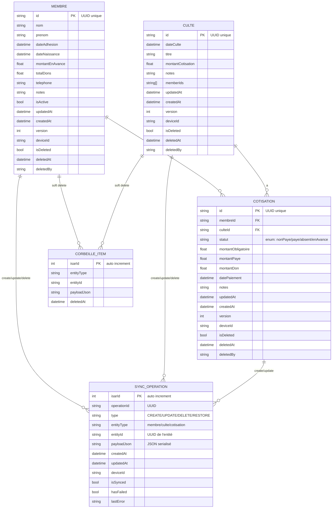
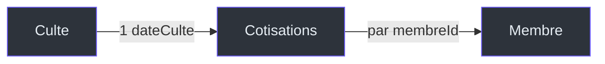
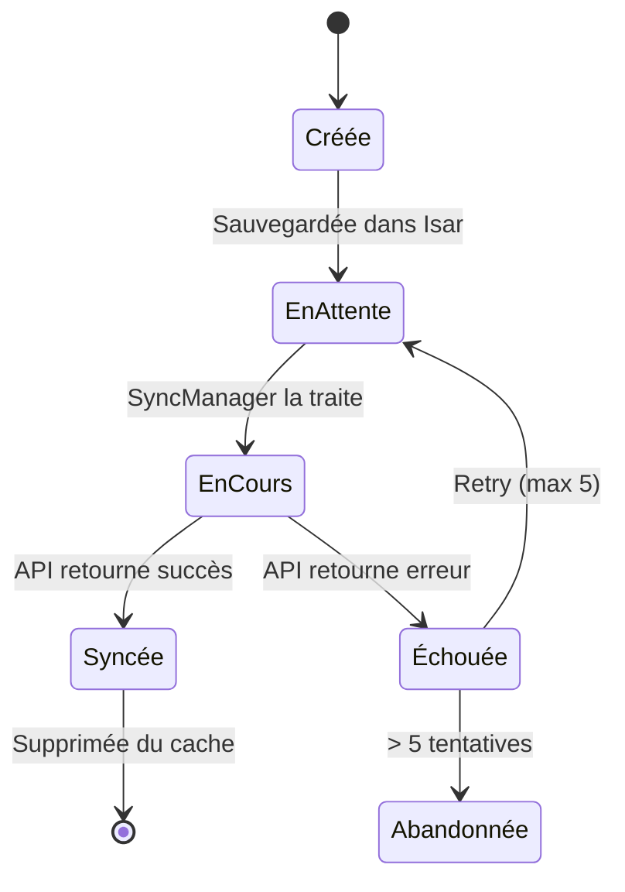
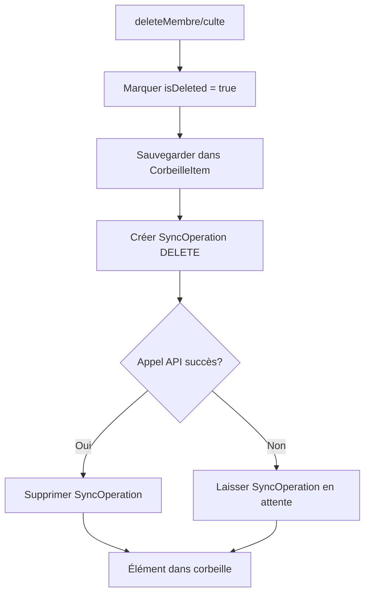

# Data Models

Schéma complet des modèles de données Kased App.

## Aperçu du Schéma



## Modèle Membre

**Fichier source :** `lib/models/membre.dart`

```dart
@collection
class Membre {
  Id isarId = Isar.autoIncrement;

  @Index(unique: true, replace: true)
  late String id; // UUID utilisé comme clé InsForge

  late String nom;
  late String prenom;
  late DateTime dateAdhesion;
  DateTime? dateNaissance;
  double montantEnAvance = 0.0; // Montant payé d'avance
  double totalDons = 0.0; // Total cumulé des dons (excédents)
  String? telephone;
  String? notes;
  bool isActive = true;
  DateTime? updatedAt;
  DateTime createdAt = DateTime.now();
  int version = 1;
  String deviceId = '';
  bool isDeleted = false;
  DateTime? deletedAt;
  String? deletedBy;
}
```

### Champs Calculés (`@ignore`)

| Champ | Type | Description | Exemple |
|-------|------|-------------|---------|
| `nomComplet` | `String` | `"Prénom Nom"` | `"Jean Dupont"` |
| `initiales` | `String` | Première lettre prénom + nom | `"JD"` |
| `anniversaireAujourdHui` | `bool` | Vrai si anniversaire aujourd'hui | `true` |
| `age` | `int?` | Âge calculé | `35` |

### Validation

```dart
// Dans MemberHandler.createMember()
final newMembre = Membre()
  ..id = UuidUtils.generate()  // UUID v4
  ..nom = action.nom
  ..prenom = action.prenom
  ..dateAdhesion = action.dateAdhesion
  ..dateNaissance = action.dateNaissance
  ..telephone = action.telephone
  ..notes = action.notes
  ..isActive = true
  ..deviceId = deviceId
  ..createdAt = now
  ..updatedAt = now;
```

### Représentation JSON (InsForge)

```dart
Map<String, dynamic> toJson() => {
  'nom': nom,
  'prenom': prenom,
  'date_adhesion': dateAdhesion.toIso8601String().substring(0, 10),
  if (dateNaissance != null) 'date_naissance': dateNaissance!.toIso8601String().substring(0, 10),
  'montant_en_avance': montantEnAvance,
  'total_dons': totalDons,
  if (telephone != null) 'telephone': telephone,
  if (notes != null) 'notes': notes,
  'is_active': isActive,
  if (updatedAt != null) 'updated_at': updatedAt!.toIso8601String(),
  'created_at': createdAt.toIso8601String(),
  'version': version,
  'device_id': deviceId,
  'is_deleted': isDeleted,
  if (deletedAt != null) 'deleted_at': deletedAt!.toIso8601String(),
  if (deletedBy != null) 'deleted_by': deletedBy,
};
```

## Modèle Culte

**Fichier source :** `lib/models/culte.dart`

```dart
@collection
class Culte {
  Id isarId = Isar.autoIncrement;

  @Index(unique: true, replace: true)
  late String id;

  late DateTime dateCulte;
  String? titre;
  double montantCotisation = 50.0; // Montant par défaut (50 FCFA)
  String? notes;
  DateTime? updatedAt;
  DateTime createdAt = DateTime.now();
  int version = 1;
  String deviceId = '';
  bool isDeleted = false;
  DateTime? deletedAt;
  String? deletedBy;

  // IDs des membres actifs au moment de la création
  @Index()
  List<String> memberIds = [];
}
```

### Règles Métier

| Règle | Implémentation | Fichier |
|-------|---------------|---------|
| Verrouillage après 30 jours | `DateTime.now().difference(culte.dateCulte).inDays > 30` | `lib/store/handlers/culte_handler.dart:71` |
| Montant par défaut | `montantCotisation = 50.0` | `lib/models/culte.dart:14` |
| Jours avant purge corbeille | `KasedConstants.joursAvantPurgeCorbeille = 30` | `lib/core/constants.dart:14` |

## Modèle Cotisation

**Fichier source :** `lib/models/cotisation.dart`

```dart
enum StatutCotisation {
  nonPaye,   // Culte passé, pas encore payé
  paye,      // Payé (le jour même ou en rattrapage)
  absent,    // Membre absent ce dimanche
  enAvance,  // Payé AVANT la date du culte
}

@collection
class Cotisation {
  Id isarId = Isar.autoIncrement;

  @Index(unique: true, replace: true)
  late String id;

  @Index()
  late String membreId;

  @Index()
  late String culteId;

  @Enumerated(EnumType.name)
  late StatutCotisation statut;

  double montantObligatoire = 50.0;
  double montantPaye = 0.0;
  double montantDon = 0.0; // Excédent (dons)

  DateTime? datePaiement;
  String? notes;
  DateTime? updatedAt;
  DateTime createdAt = DateTime.now();
  int version = 1;
  String deviceId = '';
  bool isDeleted = false;
  DateTime? deletedAt;
  String? deletedBy;
}
```

### Détermination du Statut

**Fichier :** `lib/core/logic/cotisation_logic.dart`

```dart
class CotisationLogic {
  static StatutCotisation determinerStatut({
    required DateTime datePaiement,
    required DateTime dateCulte,
  }) {
    if (datePaiement.isBefore(dateCulte)) {
      return StatutCotisation.enAvance;
    }
    return StatutCotisation.paye;
  }
}
```

### Champs Calculés

| Champ | Logique | Fichier |
|-------|---------|---------|
| `estPaye` | `statut != absent && montantPaye >= montantObligatoire` | `lib/models/cotisation.dart:47` |
| `estEnRetard` | `statut != absent && montantPaye < montantObligatoire` | `lib/models/cotisation.dart:51` |
| `uniqueKey` | `'${membreId}_$culteId'` | `lib/models/cotisation.dart:43` |

### Relation Culte → Cotisations



**Pourquoi cette relation ?** Un culte a N cotisations (une par membre). Cette relation permet de :
1. Calculer la collecte totale d'un culte
2. Identifier les membres en retard pour un culte donné
3. Permettre le paiement en masse (`bulkSetPaiements`)

## Modèle SyncOperation

**Fichier source :** `lib/models/sync_operation.dart`

```dart
@collection
class SyncOperation {
  Id isarId = Isar.autoIncrement;

  late String operationId;      // UUID de l'opération
  late String type;             // 'CREATE', 'UPDATE', 'DELETE', 'RESTORE'
  
  @Index()
  late String entityType;       // 'membre', 'culte', 'cotisation'
  
  @Index()
  late String entityId;         // UUID de l'entité concernée
  
  late String payloadJson;      // JSON sérialisé de l'entité
  late DateTime createdAt;
  DateTime? updatedAt;
  late String deviceId;
  
  @Index()
  bool isSynced = false;
  
  bool hasFailed = false;
  String? lastError;
}
```

### Cycle de Vie



### Payload JSON

Le `payloadJson` contient la représentation JSON complète de l'entité au moment de l'opération :

```json
{
  "operationId": "uuid-1234",
  "type": "CREATE",
  "entityType": "membre",
  "entityId": "uuid-5678",
  "payloadJson": "{\"nom\":\"Dupont\",\"prenom\":\"Jean\",...}",
  "createdAt": "2026-08-29T10:30:00.000Z",
  "deviceId": "device_1234567890",
  "isSynced": false
}
```

## Modèle CorbeilleItem

**Fichier source :** `lib/models/corbeille_item.dart`

```dart
@collection
class CorbeilleItem {
  Id isarId = Isar.autoIncrement;

  late String entityType;   // 'membre' ou 'culte'
  late String entityId;     // UUID de l'entité supprimée
  late String payloadJson;  // Données complètes de l'entité
  late DateTime deletedAt;  // Date de suppression
}
```

### Flux de Suppression



### Purge Automatique

**Fichier :** `lib/core/constants.dart:14`

```dart
static const int joursAvantPurgeCorbeille = 30;
```

Les éléments de la corbeille âgés de plus de 30 jours sont purgeés automatiquement lors du prochain sync.

## Tables Isar — Résumé

| Collection | Indexs | Unique | Description |
|------------|--------|--------|-------------|
| `membres` | `id` (unique), `isDeleted` | `id` | Membres de l'église |
| `cultes` | `id` (unique), `dateCulte` (desc) | `id` | Cultes/rendez-vous |
| `cotisations` | `id` (unique), `membreId`, `culteId` | `id`, composite `membreId+culteId` | Paiements |
| `syncOperations` | `entityType`, `entityId`, `isSynced` | — | Ops en attente |
| `corbeilleItems` | — | — | Éléments supprimés |

## Voir Aussi

- [Architecture](Architecture) — Comment les modèles sont utilisés
- [Offline-First Sync](Offline-First-Sync) — Comment les SyncOperations fonctionnent
- [State Management](State-Management) — Comment les modèles sont exposés au store
