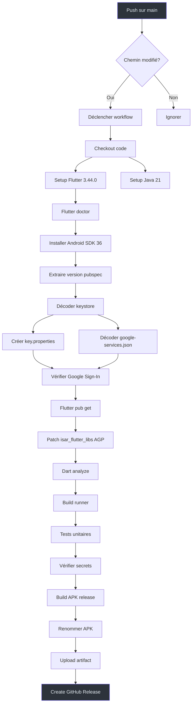
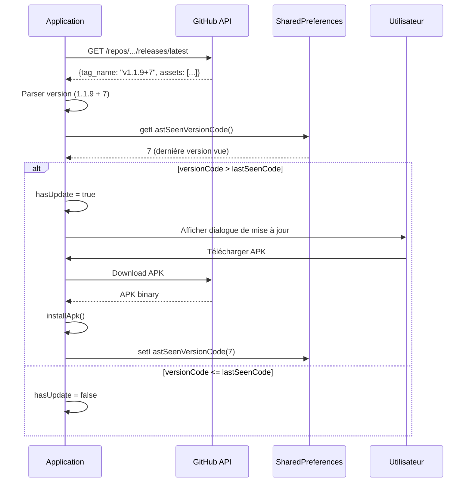

# Deployment

Pipeline CI/CD et processus de déploiement de Kased App.

## Pipeline CI/CD

**Fichier :** `.github/workflows/build-release.yml`



## Workflow détaillé

### Étape 1 : Checkout

```yaml
- name: Checkout
  uses: actions/checkout@v4
  with:
    fetch-depth: 0  # Nécessaire pour le versioning
```

### Étape 2 : Setup Flutter

```yaml
- name: Setup Flutter
  uses: subosito/flutter-action@v2
  with:
    flutter-version: '3.44.0'
    channel: stable
    cache: true
```

### Étape 3 : Extraire la Version

```bash
VERSION=$(grep '^version:' pubspec.yaml | awk '{print $2}' | head -1)
echo "APP_VERSION=$VERSION" >> $GITHUB_ENV
```

**Format de version :** `MAJOR.MINOR.PATCH+BUILD`
- `MAJOR` : Changements majeurs
- `MINOR` : Nouvelles fonctionnalités
- `PATCH` : Corrections de bugs
- `BUILD` : Build number (incremental)

### Étape 4 : Décoder le Keystore

```bash
echo "$UPLOAD_KEYSTORE_B64" | base64 -d > android/upload-keystore.jks
```

**Pourquoi décoder ?** Le keystore est stocké en base64 dans les GitHub Secrets pour des raisons de sécurité.

### Étape 5 : Patch isar_flutter_libs

```bash
# Ajouter namespace pour compatibilité AGP 8.x
sed -i '/^android {/a\    namespace = "dev.isar.isar_flutter_libs"' "$ISAR_GRADLE"

# Mettre à jour compileSdk à 36
sed -i 's/^[[:space:]]*compileSdkVersion[[:space:]]*[0-9]*/    compileSdk = 36/' "$ISAR_GRADLE"

# Supprimer l'attribut package deprecated
sed -i 's/package="[^"]*"//g' "$ISAR_MANIFEST"
```

**Pourquoi patcher ?** `isar_flutter_libs` utilise un ancien format Gradle incompatible avec AGP 8.x.

### Étape 6 : Build APK

```bash
flutter build apk \
  --release \
  --android-skip-build-dependency-validation \
  --dart-define=INSFORGE_BASE_URL=${{ secrets.INSFORGE_URL }} \
  --dart-define=INSFORGE_ANON_KEY=${{ secrets.INSFORGE_ANON_KEY }} \
  --dart-define=GOOGLE_SERVER_CLIENT_ID=${{ secrets.GOOGLE_WEB_CLIENT_ID }} \
  --dart-define=SENTRY_DSN=${{ secrets.SENTRY_DSN || '' }} \
  --dart-define=GOOGLE_AUTH_BRIDGE_URL=${{ secrets.GOOGLE_AUTH_BRIDGE_URL }}
```

**Note :** Le flag `--android-skip-build-dependency-validation` est nécessaire car `isar_flutter_libs` a des dépendances Gradle qui ne sont pas validées par le build CI.

### Étape 7 : Upload Artifact

```yaml
- name: Upload APK artifact
  uses: actions/upload-artifact@v4
  with:
    name: kased-v${{ env.APP_VERSION }}
    path: cotis_app/build/kased-v${{ env.APP_VERSION }}.apk
    retention-days: 30
    compression-level: 9
```

### Étape 8 : Create GitHub Release

```yaml
- name: Create GitHub Release
  uses: softprops/action-gh-release@v2
  with:
    tag_name: v${{ env.APP_VERSION }}
    name: 'Kased v${{ env.APP_VERSION }}'
    files: cotis_app/build/kased-v${{ env.APP_VERSION }}.apk
    overwrite_files: true
```

**Important :** `overwrite_files: true` permet de remplacer l'APK existant dans la release (GitHub releases sont immutables par défaut).

## Secrets GitHub

### Secrets Obligatoires

| Secret | Description | Exemple |
|--------|-------------|---------|
| `INSFORGE_URL` | URL du backend InsForge | `https://pu74z8pe.us-east.insforge.app` |
| `INSFORGE_ANON_KEY` | Clé API anon InsForge | `anon_75c09927...` |
| `GOOGLE_WEB_CLIENT_ID` | Web Client ID Google (aussi utilisé comme SERVER_CLIENT_ID) | `535496831713-xxxx.apps.googleusercontent.com` |
| `GOOGLE_AUTH_BRIDGE_URL` | URL du bridge Google Auth | `https://pu74z8pe.us-east.insforge.app/functions/google-auth-bridge` |
| `UPLOAD_KEYSTORE_B64` | Keystore de signature (base64) | `MIIEvQIBADANBg...` |
| `KEYSTORE_PASSWORD` | Mot de passe du keystore | `xxxxxxx` |
| `KEY_ALIAS` | Alias de la clé | `upload` |
| `KEY_PASSWORD` | Mot de passe de la clé | `xxxxxxx` |

### Secrets Optionnels

| Secret | Description | Usage |
|--------|-------------|-------|
| `SENTRY_DSN` | DSN Sentry | Monitoring des erreurs |
| `ONESIGNAL_REST_API_KEY` | Clé API OneSignal | Push notifications |
| `GOOGLE_SERVICES_JSON_B64` | google-services.json (base64) | Firebase Cloud Messaging |

### Configuration des Secrets

```bash
# Via GitHub CLI
gh secret set INSFORGE_URL --body "https://pu74z8pe.us-east.insforge.app"
gh secret set INSFORGE_ANON_KEY --body "anon_75c09927..."
gh secret set GOOGLE_WEB_CLIENT_ID --body "535496831713-xxxx.apps.googleusercontent.com"
gh secret set GOOGLE_AUTH_BRIDGE_URL --body "https://pu74z8pe.us-east.insforge.app/functions/google-auth-bridge"

# Pour le keystore (convertir en base64)
base64 android/upload-keystore.jks > keystore.b64
gh secret set UPLOAD_KEYSTORE_B64 --body "$(cat keystore.b64)"
```

## Déploiement des Fonctions Serveur

**Fichier :** `.github/workflows/deploy-functions.yml`

```yaml
name: Deploy InsForge Functions

on:
  push:
    branches: [main]
    paths:
      - 'cotis_app/functions/**'
      - 'scripts/deploy-insforge-functions.sh'
  workflow_dispatch:
    inputs:
      slug:
        description: 'Nom de la fonction à déployer'
        required: false
        default: 'all'
```

### Script de Déploiement

**Fichier :** `scripts/deploy-insforge-functions.sh`

```bash
#!/bin/bash
set -euo pipefail

INSFORGE_BASE_URL="${INSFORGE_BASE_URL:?INSFORGE_BASE_URL is required}"
INSFORGE_ANON_KEY="${INSFORGE_ANON_KEY:?INSFORGE_ANON_KEY is required}"
ONESIGNAL_REST_API_KEY="${ONESIGNAL_REST_API_KEY:-}"

# Déployer google-auth-bridge
echo "Deploying google-auth-bridge..."
curl -X POST "$INSFORGE_BASE_URL/api/deploy/function" \
  -H "apikey: $INSFORGE_ANON_KEY" \
  -H "Authorization: Bearer $INSFORGE_ANON_KEY" \
  -H "Content-Type: application/json" \
  -d '{
    "slug": "google-auth-bridge",
    "content": "'$(cat cotis_app/functions/google-auth-bridge.js)'",
    "env": {
      "ONESIGNAL_REST_API_KEY": "'$ONESIGNAL_REST_API_KEY'"
    }
  }'

echo "✅ google-auth-bridge deployed"
```

## Génération du Keystore

```bash
# Générer un nouveau keystore
keytool -genkeypair -v \
  -storetype PKCS12 \
  -keystore upload-keystore.jks \
  -alias upload \
  -keyalg RSA \
  -keysize 2048 \
  -validity 10000 \
  -storepass YOUR_KEYSTORE_PASSWORD \
  -keypass YOUR_KEY_PASSWORD

# Convertir en base64 pour les secrets
base64 upload-keystore.jks > upload-keystore.b64
```

### Configuration dans Android

**Fichier :** `android/app/build.gradle`

```groovy
def keystoreProperties = new Properties()
def keystorePropertiesFile = rootProject.file('key.properties')
if (keystorePropertiesFile.exists()) {
    keystoreProperties.load(new FileInputStream(keystorePropertiesFile))
}

android {
    signingConfigs {
        release {
            keyAlias keystoreProperties['keyAlias']
            keyPassword keystoreProperties['keyPassword']
            storeFile keystoreProperties['storeFile'] ? file(keystoreProperties['storeFile']) : null
            storePassword keystoreProperties['storePassword']
        }
    }
    buildTypes {
        release {
            signingConfig signingConfigs.release
        }
    }
}
```

**Fichier :** `android/key.properties` (généré par le workflow CI)

```properties
storeFile=../upload-keystore.jks
keyAlias=upload
keyPassword=xxxxxxxx
storePassword=xxxxxxxx
```

## Auto-Update System

**Fichier :** `lib/core/updates/update_service.dart`



### Configuration

**Fichier :** `lib/core/updates/update_config.dart`

```dart
class UpdateConfig {
  static const String githubRepo = 'joynagassi-cyber/kased-app';
  static const String githubReleasesUrl = 
      'https://api.github.com/repos/$githubRepo/releases/latest';
  static const String lastSeenVersionCodeKey = 'kased_last_seen_version_code';
}
```

## Monitoring des Builds

```bash
# Voir les workflows GitHub
gh run list --repo joynagassi-cyber/kased-app

# Voir les logs d'un workflow
gh run view <run_id> --log

# Voir les releases
gh release list --repo joynagassi-cyber/kased-app
```

## Voir Aussi

- [Getting Started](Getting-Started) — Configuration des secrets en local
- [Authentication](Authentication) — Configuration Google Sign-In
- [Architecture](Architecture) — Vue d'ensemble du projet
