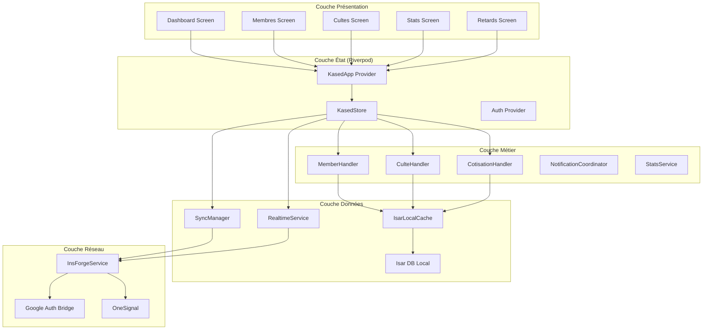

# Kased App

Gestion de cotisations d'église — Application Flutter multiplateforme.



## 📚 Table des Matières

| Page | Description |
|------|-------------|
| [🚀 Getting Started](Getting-Started) | Installation, configuration, premiers pas |
| [🏗️ Architecture](Architecture) | Vue d'ensemble technique, couches, patterns |
| [📊 Modèles de Données](Data-Models) | Schéma Isar, relations, champs |
| [⚡ State Management](State-Management) | Riverpod, KasedStore, actions |
| [🔄 Sync Offline-First](Offline-First-Sync) | Synchronisation, merge strategy, retry |
| [🔌 Temps Réel](Realtime-System) | Socket.IO, patch engine, présence |
| [🔐 Authentification](Authentication) | Email, Google OAuth, bridge v7 |
| [🎨 UI/UX](UI-UX) | Design system, thèmes, navigation |
| [🧪 Tests](Testing) | Stratégie de tests, patterns |
| [🚢 Déploiement](Deployment) | CI/CD, GitHub Actions, releases |
| [📖 API Reference](API-Reference) | Endpoints InsForge, constantes |
| [📝 Glossaire](Glossary) | Termes techniques et métier |

## 🎯 Vue Rapide

| Aspect | Détail |
|--------|--------|
| **Framework** | Flutter 3.x / Dart 3.x |
| **State Management** | Riverpod 2.6 avec code generation |
| **Navigation** | GoRouter 17.x |
| **Base locale** | Isar 3.x (chiffrée AES-256) |
| **Backend** | InsForge BaaS (PostgreSQL + PostgREST) |
| **Auth** | Email/Password + Google OAuth |
| **Push** | OneSignal (multi-utilisateurs) |
| **Monitoring** | Sentry + Firebase Crashlytics |
| **CI/CD** | GitHub Actions (build + release auto) |
| **Fichiers Dart** | 129 fichiers dans `lib/` |

## ⚡ Démarrage Rapide

```bash
# 1. Cloner le repo
git clone https://github.com/joynagassi-cyber/kased-app.git
cd kased-app/cotis_app

# 2. Installer les dépendances
flutter pub get

# 3. Générer le code (Riverpod, Isar)
dart run build_runner build --delete-conflicting-outputs

# 4. Lancer l'application
flutter run \
  --dart-define=INSFORGE_BASE_URL=https://pu74z8pe.us-east.insforge.app \
  --dart-define=INSFORGE_ANON_KEY=<votre-clé>
```

## 🔗 Liens Utiles

- [README](https://github.com/joynagassi-cyber/kased-app/blob/main/cotis_app/README.md)
- [Build & Release Workflow](https://github.com/joynagassi-cyber/kased-app/blob/main/.github/workflows/build-release.yml)
- [Architecture Doc](https://github.com/joynagassi-cyber/kased-app/blob/main/docs-architect/KASED-APP-ARCHITECTURE.md)
- [Releases](https://github.com/joynagassi-cyber/kased-app/releases)
