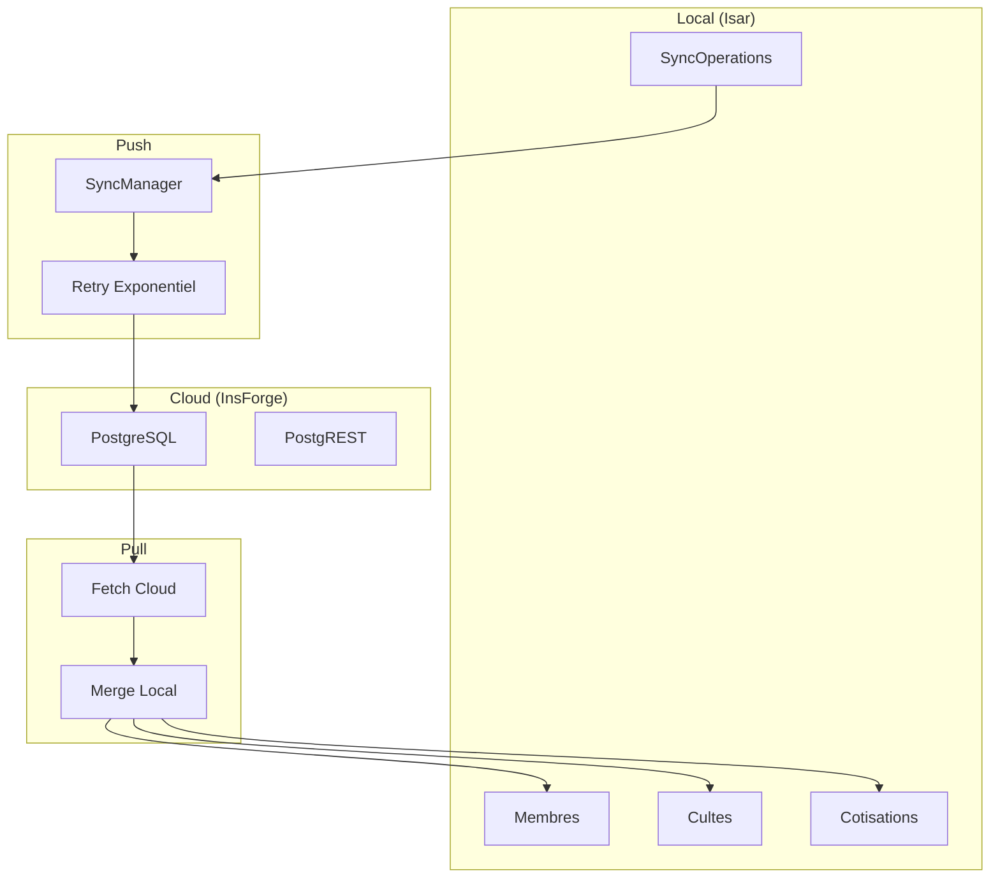
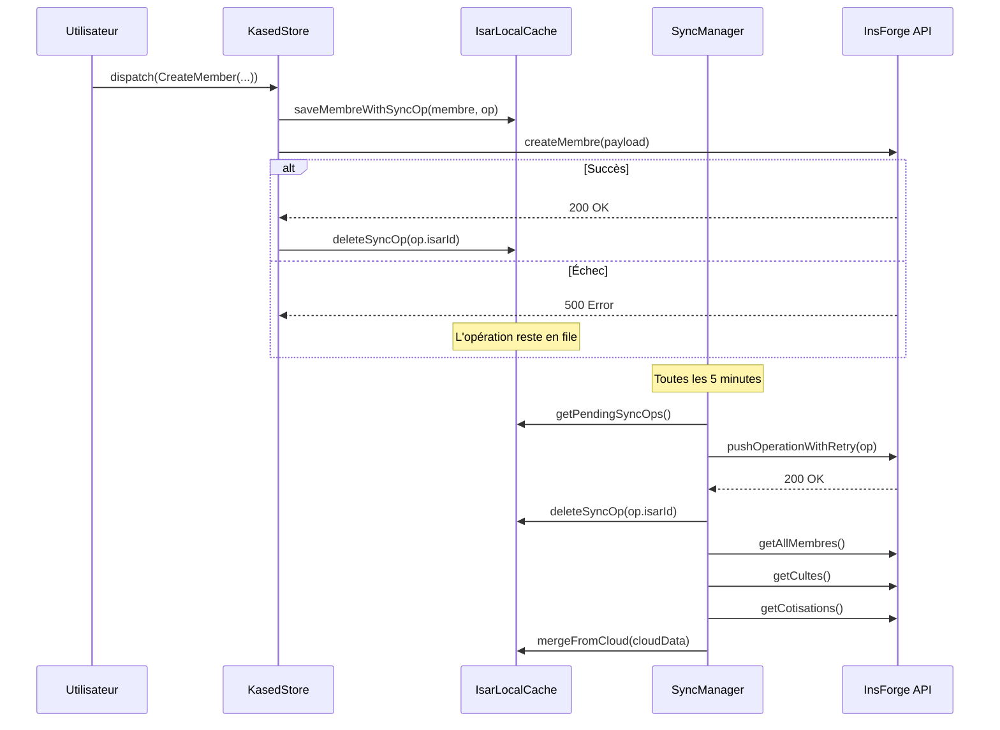
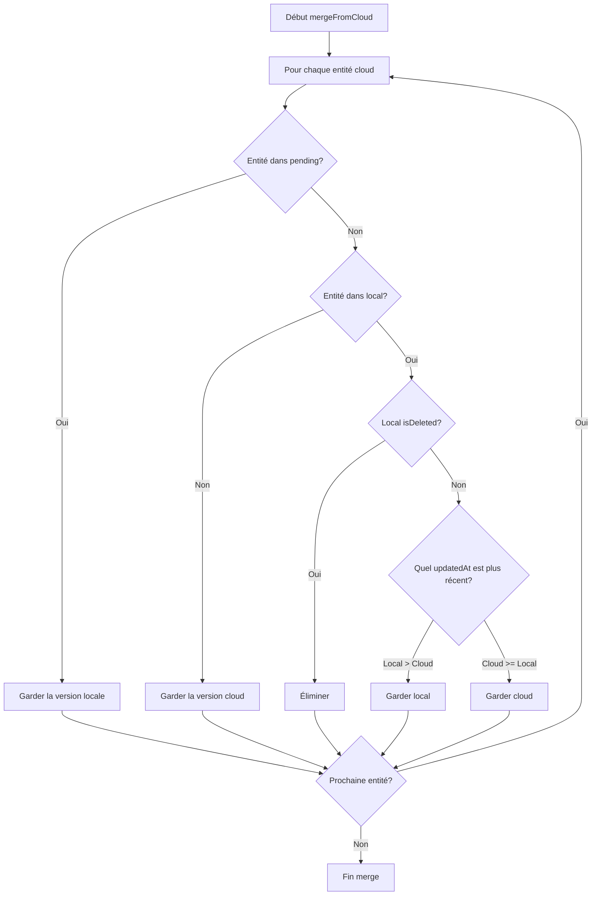

# Offline-First Sync

Architecture de synchronisation offline-first de Kased App.

## Principe Fondamental

Kased suit le pattern **offline-first** : l'Isar local est la source de vérité principale. Les données cloud sont synchronisées en arrière-plan.



## Flux de Synchronisation



## SyncManager — L'Orchestrateur

**Fichier :** `lib/core/sync/sync_manager.dart`

```dart
class SyncManager {
  final InsForgeServicePort _api;
  final LocalCache _cache;
  bool _isSyncing = false;

  Future<SyncResult?> runSync({
    required bool isOffline,
    Duration throttle = KasedConstants.syncThrottle,
    DateTime? lastSyncAt,
  }) async {
    if (isOffline) return null;
    if (_isSyncing) return null; // Anti-réentrance

    _isSyncing = true;
    try {
      return await _doSync(lastSyncAt: lastSyncAt);
    } finally {
      _isSyncing = false;
    }
  }

  Future<SyncResult> _doSync({DateTime? lastSyncAt}) async {
    int pushed = 0;
    int failed = 0;

    // 1. Pousser la queue
    final pendingOps = await _cache.getPendingSyncOps();
    final pendingMembreIds = <String>{};
    final pendingCulteIds = <String>{};
    final pendingCotisationIds = <String>{};

    for (final op in pendingOps) {
      try {
        await _pushOperationWithRetry(op);
        pushed++;
        // Ajouter temporairement aux pending pour protéger le merge
        if (op.entityType == 'membre') pendingMembreIds.add(op.entityId);
        else if (op.entityType == 'culte') pendingCulteIds.add(op.entityId);
        else if (op.entityType == 'cotisation') pendingCotisationIds.add(op.entityId);

        await _cache.deleteSyncOp(op.isarId);
      } catch (e) {
        failed++;
        debugPrint('Sync: op ${op.isarId} définitivement échouée: $e');
      }
    }

    // 2. Fetch from Cloud
    final remoteMembresJson = await _api.getAllMembres();
    final remoteCultesJson = await _api.getCultes(page: 1, pageSize: 200);
    final remoteCotisationsJson = await _api.getCotisations();

    final remoteMembres = remoteMembresJson.map((j) => Membre.fromJson(j)).toList();
    final remoteCultes = remoteCultesJson.map((j) => Culte.fromJson(j)).toList();
    final remoteCotisations = remoteCotisationsJson.map((j) => Cotisation.fromJson(j)).toList();

    // 3. Merge local ↔ cloud (protégé par les pending)
    await _cache.mergeFromCloud(
      cloudMembres: remoteMembres,
      cloudCultes: remoteCultes,
      cloudCotisations: remoteCotisations,
      pendingMembreIds: pendingMembreIds,
      pendingCulteIds: pendingCulteIds,
      pendingCotisationIds: pendingCotisationIds,
    );

    return SyncResult(
      success: true,
      operationsPushed: pushed,
      operationsFailed: failed,
      membresRemote: remoteMembres.length,
      cultesRemote: remoteCultes.length,
      cotisationsRemote: remoteCotisations.length,
    );
  }
```

## Retry Exponentiel

**Fichier :** `lib/core/sync/sync_manager.dart:156-204`

```dart
Future<void> _pushOperationWithRetry(SyncOperation op) async {
  int delaySeconds = 1;

  for (int attempt = 0;
      attempt < KasedConstants.syncMaxRetries;
      attempt++) {
    try {
      final payload = jsonDecode(op.payloadJson) as Map<String, dynamic>;
      payload['updated_at'] = op.updatedAt?.toIso8601String() ?? op.createdAt.toIso8601String();

      if (op.entityType == 'membre') {
        if (op.type == 'CREATE') {
          await _api.createMembre(payload);
        } else if (op.type == 'UPDATE') {
          await _api.updateMembre(op.entityId, payload);
        } else if (op.type == 'DELETE') {
          await _api.deleteMembre(op.entityId);
        }
      }
      // ... autres types
      
      return; // Succès
    } catch (e) {
      if (attempt < KasedConstants.syncMaxRetries - 1) {
        await Future.delayed(Duration(seconds: delaySeconds));
        delaySeconds *= 2; // Backoff exponentiel
      } else {
        rethrow;
      }
    }
  }
}
```

**Timeline de retry :**

| Tentative | Délai | Cumulatif |
|-----------|-------|-----------|
| 1 | 0s | 0s |
| 2 | 1s | 1s |
| 3 | 2s | 3s |
| 4 | 4s | 7s |
| 5 | 8s | 15s |

Après 5 échecs, l'opération est marquée `hasFailed = true` et n'est plus réessayée automatiquement.

## Merge Strategy

**Fichier :** `lib/core/isar_local_cache.dart:180-304`

### Algorithme de Merge



### Implémentation

```dart
Future<void> mergeFromCloud({...}) => _isar.writeTxn(() async {
  // ── Membres ─────────────────────────────────────────
  final localMembres = await _isar.membres.where().findAll();
  final cloudMembresById = {for (final m in cloudMembres) m.id: m};
  final localMembresById = {for (final m in localMembres) m.id: m};
  final mergedMembres = <Membre>[];

  final allMembreIds = {...cloudMembresById.keys, ...localMembresById.keys};
  for (final id in allMembreIds) {
    // Si l'entité a une opération en attente, garder la version locale
    if (pendingMembreIds.contains(id)) {
      if (localMembresById.containsKey(id)) {
        mergedMembres.add(localMembresById[id]!);
      }
      continue;
    }
    
    final cloud = cloudMembresById[id];
    final local = localMembresById[id];
    
    // Si local est supprimé et ne contient aucune opération, l'éliminer
    if (local != null && local.isDeleted) {
      continue;
    }
    
    if (cloud != null && local != null) {
      mergedMembres.add(_pickMembre(local, cloud));
    } else {
      if (cloud != null) mergedMembres.add(cloud);
      else if (local != null && !local.isDeleted) mergedMembres.add(local);
    }
  }

  await _isar.membres.clear();
  await _isar.membres.putAll(mergedMembres);
  // ... même logique pour cultes et cotisations
});
```

### `_pickMembre()` — Comparaison des Timestamps

```dart
Membre _pickMembre(Membre local, Membre cloud) {
  if (local.updatedAt == null && cloud.updatedAt == null) return cloud;
  if (local.updatedAt == null) return cloud;
  if (cloud.updatedAt == null) return local;
  return local.updatedAt!.isAfter(cloud.updatedAt!) ? local : cloud;
}
```

**Pourquoi le server bat le local ?** Parce que le server est la source de vérité globale. Si un autre appareil a modifié l'entité plus récemment, on prend sa version.

**Exception :** Les opérations en attente (pending) sont protégées — on ne les écrase pas.

## Throttle

**Fichier :** `lib/core/sync/sync_service.dart`

```dart
class SyncService {
  DateTime? _lastSyncAt;
  static const _syncThrottle = Duration(minutes: 5);

  bool shouldSync() {
    if (_lastSyncAt == null) return true;
    if (DateTime.now().difference(_lastSyncAt!) > _syncThrottle) return true;
    return true; // Toujours synchroniser s'il y a des ops en attente
  }
}
```

**Pourquoi 5 minutes ?** Éviter le spam d'appels API tout en maintenant une synchro relativement récente.

## Bug Fix : Suppress Duplicate Sync Operations

**Fix appliqué le 2026-08-29** (commit lié au bug fix SYNC) :

Quand un appel réseau direct succeed, l'opération sync créée précédemment doit être supprimée avec `_cache.deleteSyncOp(syncOp.isarId)`. Sinon, le sync automatique (toutes les 5 minutes) réessaie et cause des doublons UUID.

**Fichiers affectés :**
- `lib/store/handlers/member_handler.dart` (createMember, updateMember, addPaymentAdvance, deleteMember)
- `lib/store/handlers/culte_handler.dart` (createCulte, updateCulte, deleteCulte)
- `lib/store/kased_store.dart` (toutes les actions)

**Exceptions :** Les flux qui n'ont pas de `syncOp` avant l'appel réseau (ex: `enregistrerPaiementPersonnel`, `marquerAbsent`, `payerPlusieursCultesEnAvance`, `bulkSetPaiements`) ne doivent pas être modifiés.

## Anti-Réentrance

```dart
bool _isSyncing = false;

Future<SyncResult?> runSync({...}) async {
  if (isOffline) return null;
  if (_isSyncing) return null; // Un seul sync à la fois

  _isSyncing = true;
  try {
    return await _doSync(lastSyncAt: lastSyncAt);
  } finally {
    _isSyncing = false;
  }
}
```

**Pourquoi ?** Éviter les écritures concurrentes dans Isar qui pourraient corrompre les données.

## Events de Sync

| Event | Déclencheur | Action |
|-------|-------------|--------|
| `SyncData` | Bouton refresh, changement de connectivité, timer 5min | `runSync()` complet |
| `LoadDashboard` | Creation d'un membre/culte | `_handleLoadDashboard()` |
| `data_changed` | Socket.IO événement | Patch local + reload différé |

## Voir Aussi

- [Architecture](Architecture) — Vue d'ensemble
- [Data Models](Data-Models) — Structure des entités
- [Realtime System](Realtime-System) — Synchronisation en temps réel
- [State Management](State-Management) — Comment le state est mis à jour
