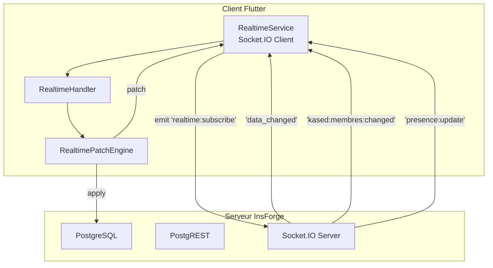

# Realtime System

Synchronisation temps réel de Kased App via Socket.IO.

## Architecture



## RealtimeService — Connexion Socket.IO

**Fichier :** `lib/core/realtime/realtime_service.dart`

```dart
class RealtimeService {
  static final RealtimeService _instance = RealtimeService._internal();
  factory RealtimeService() => _instance;
  RealtimeService._internal();

  IO.Socket? _socket;
  final List<RealtimeEventHandler> _eventHandlers = [];
  final List<PresenceChangeHandler> _presenceHandlers = [];
  bool _isConnected = false;
  int _reconnectAttempts = 0;
  static const _reconnectDelayMs = 1000;
  static const _heartbeatIntervalMs = 30000;
  static const _deviceIdKey = 'kased_realtime_device_id';

  String? _deviceId;
  String? _currentUserEmail;
  String? _currentToken;
  String? _currentChannel;
```

### Connexion

```dart
Future<void> connect({String? token, String? email}) async {
  if (_socket != null) {
    await disconnect();
  }

  _currentToken = token;
  _currentUserEmail = email;

  final deviceId = await _getOrLoadDeviceId();
  final useToken = token ?? InsForgeConfig.effectiveAnonKey;

  final opts = IO.OptionBuilder()
      .setTransports(['websocket'])
      .setQuery({
        'token': useToken,
        'deviceId': deviceId,
        'platform': kIsWeb ? 'web' : 'mobile',
      })
      .setAuth({'token': useToken})
      .setExtraHeaders({
        'deviceId': deviceId,
        'email': email ?? '',
      })
      .build();

  _socket = IO.io(InsForgeConfig.baseUrl, opts);
```

### Subscriptions

```dart
_socket!.onConnect((_) {
  _socket!.emit('realtime:subscribe', {'channel': 'kased:all'});
  _socket!.emit('realtime:subscribe', {'channel': 'kased:private'});
  _socket!.emit('realtime:subscribe', {'channel': 'kased:membres'});
  _socket!.emit('realtime:subscribe', {'channel': 'kased:cultes'});
  _socket!.emit('realtime:subscribe', {'channel': 'kased:cotisations'});
  _startHeartbeat();
});
```

### Événements Écoutés

| Événement | Channel | Action |
|-----------|---------|--------|
| `data_changed` | `kased:all` | Événement générique |
| `kased:membres:changed` | `kased:membres` | Mise à jour membre |
| `kased:membres:deleted` | `kased:membres` | Suppression membre |
| `kased:cultes:changed` | `kased:cultes` | Mise à jour culte |
| `kased:cultes:deleted` | `kased:cultes` | Suppression culte |
| `kased:cotisations:changed` | `kased:cotisations` | Mise à jour cotisation |
| `kased:cotisations:deleted` | `kased:cotisations` | Suppression cotisation |
| `presence:update` | — | Changement de présence |

### Heartbeat

```dart
void _startHeartbeat() {
  Timer.periodic(const Duration(milliseconds: _heartbeatIntervalMs), (_) {
    if (_isConnected && _socket != null) {
      _socket!.emit('heartbeat', {
        'deviceId': _deviceId,
        'email': _currentUserEmail,
        'timestamp': DateTime.now().toIso8601String(),
      });
    }
  });
}
```

**Pourquoi 30 secondes ?** Maintenir la présence active sans surcharger le serveur.

### Reconnexion Auto

```dart
_socket!.onReconnectAttempt((attempt) {
  _reconnectAttempts = attempt;
  final delay = _reconnectDelayMs * (1 << attempt.clamp(0, 5));
  debugPrint('[Realtime] Reconnexion tentative $_reconnectAttempts dans ${delay}ms');
});

_socket!.onReconnect((_) {
  _isConnected = true;
  _reconnectAttempts = 0;
  // Resubscribe to all channels
  _socket!.emit('realtime:subscribe', {'channel': 'kased:all'});
  // ...
});
```

**Backoff :** 1s → 2s → 4s → 8s → 16s → 32s (max)

## RealtimeHandler — Gestionnaire d'Événements

**Fichier :** `lib/core/realtime/realtime_handler.dart`

```dart
@Riverpod(keepAlive: true)
class RealtimeHandler extends _$RealtimeHandler {
  late RealtimeService _realtime;
  late RealtimePatchEngine _patchEngine;
  ReloadCallback? _reloadCallback;
  ImmediateUpdateCallback? _immediateUpdateCallback;
  DateTime? _lastReloadAt;
  Timer? _reloadDebounceTimer;

  static const _reloadDebounceDelay = Duration(seconds: 30);
```

### Connecter avec l'Authentification

```dart
void connectWithAuth({
  required String token,
  required String email,
  ReloadCallback? onReload,
  ImmediateUpdateCallback? onImmediateUpdate,
}) {
  debugPrint('[RealtimeHandler] Connexion avec auth: $email');
  _reloadCallback = onReload;
  _immediateUpdateCallback = onImmediateUpdate;
  _realtime.connect(token: token, email: email);
}
```

### Gestion des Événements

```dart
void _handleEvent(RealtimeEvent event) async {
  debugPrint('[RealtimeHandler] Event: ${event.action} ${event.table} ${event.id}');
  _patchEngine.apply(event);
  _scheduleReload();
}

void _scheduleReload() {
  final now = DateTime.now();
  final timeSinceLastReload = _lastReloadAt == null
      ? _reloadDebounceDelay
      : now.difference(_lastReloadAt!);

  if (timeSinceLastReload >= _reloadDebounceDelay) {
    // Pas de debounce nécessaire, reload immédiat
    _performReload();
  } else {
    // Programmer le reload au bout du délai restant
    final delay = _reloadDebounceDelay - timeSinceLastReload;
    _reloadDebounceTimer?.cancel();
    _reloadDebounceTimer = Timer(delay, _performReload);
  }
}
```

**Pourquoi debounce 30s ?** Si plusieurs événements arrivent en rafale (ex: update d'un membre puis update de ses cotisations), on attend 30s pour faire un seul reload complet au lieu de plusieurs.

## RealtimePatchEngine — Moteur de Patch

**Fichier :** `lib/core/realtime/realtime_patch_engine.dart`

```dart
class RealtimePatchEngine {
  final LocalCache _cache;
  final void Function() _onPatchApplied;
  final ImmediateUpdateCallback? _onImmediateUpdate;

  RealtimePatchEngine({
    required LocalCache cache,
    required void Function() onPatchApplied,
    ImmediateUpdateCallback? onImmediateUpdate,
  })  : _cache = cache,
        _onPatchApplied = onPatchApplied,
        _onImmediateUpdate = onImmediateUpdate;
```

### Application d'un Patch

```dart
Future<void> apply(RealtimeEvent event) async {
  debugPrint('[PatchEngine] Applying: ${event.action} ${event.table} ${event.id}');

  // Timestamp guard : ignorer les événements périmés
  final stale = await _isStale(_cache, event);
  if (stale) {
    debugPrint('[PatchEngine] Stale event ignored: ${event.id}');
    return;
  }

  try {
    switch (event.table) {
      case 'membres':
        await _applyMember(event);
        break;
      case 'cultes':
        await _applyCulte(event);
        break;
      case 'cotisations':
        await _applyCotisation(event);
        break;
      default:
        debugPrint('[PatchEngine] Unknown table: ${event.table}');
    }
    _onImmediateUpdate?.call();
    _onPatchApplied();
  } catch (e, stack) {
    debugPrint('[PatchEngine] Error applying patch: $e\n$stack');
  }
}
```

### Timestamp Guard

```dart
static Future<bool> _isStale(LocalCache cache, RealtimeEvent event) async {
  // Si l'entité n'existe pas localement, l'événement n'est pas stale
  bool existsLocally = false;
  switch (event.table) {
    case 'membres':
      final membres = await cache.getAllMembres();
      existsLocally = membres.any((m) => m.id == event.id);
      break;
    // ...
  }

  if (!existsLocally) return false;

  // Pas de timestamp dans l'événement → on applique
  final eventData = event.data;
  if (eventData == null) return false;

  final String? eventUpdatedAt = eventData['updated_at'] as String? ?? eventData['updatedAt'] as String?;
  if (eventUpdatedAt == null) return false;

  final DateTime eventTime = DateTime.tryParse(eventUpdatedAt) ?? DateTime.now();

  // Comparer avec la version locale
  final localTime = local.updatedAt ?? DateTime.utc(1970, 1, 1);
  return eventTime.isBefore(localTime);
}
```

**Pourquoi ?** Éviter les régressions quand un appareil envoie un événement plus ancien que ce qui est déjà localement.

### Application des Patches

```dart
Future<void> _applyMember(RealtimeEvent event) async {
  final data = event.data;
  switch (event.action) {
    case 'create':
    case 'update':
      if (data == null) return;
      final membre = Membre.fromJson(data);
      await _cache.saveMembre(membre);
      break;
    case 'delete':
      if (event.id.isEmpty) return;
      await _cache.deleteMembreById(event.id);
      break;
  }
}
```

## Timeline d'Événement

```mermaid
gantt
    title Timeline d'un événement temps réel
    dateFormat X
    axisFormat %sms
    
    section Réception
    Socket reçoit l'événement       :0, 1
    Parsing et normalisation        :1, 2
    
    section Validation
    Timestamp guard                 :3, 5
    
    section Application
    Patch local (Isar)              :8, 3
    onImmediateUpdate() → UI        :11, 2
    
    section Synchronisation
    Reload différé (debounce 30s)   :40, 30000
```



## Normalisation des Événements

**Fichier :** `lib/core/realtime/realtime_service.dart:229-270`

Le serveur InsForge peut envoyer des événements avec différents formats. Le service les normalise :

```dart
void _handleDataEvent(dynamic rawData) {
  Map<String, dynamic> data;
  if (rawData is Map) {
    data = Map<String, dynamic>.from(rawData);
  } else if (rawData is String) {
    data = jsonDecode(rawData) as Map<String, dynamic>;
  } else {
    return;
  }

  // Normaliser le format
  final String action = data['action'] as String? ?? data['event'] as String? ?? 'update';
  final String table = data['table'] as String? ?? _tableFromChannel(_currentChannel);
  final String id = data['id'] as String? ?? '';
  final Map<String, dynamic>? entityData = data['data'] as Map<String, dynamic>?;

  final resolvedData = entityData ?? data;
  final resolvedTable = table.isEmpty ? _tableFromChannel(_currentChannel) : table;

  final event = RealtimeEvent(
    action: action,
    table: resolvedTable,
    id: id,
    data: resolvedData,
  );

  // Notifier tous les écouteurs
  for (final handler in _eventHandlers) {
    handler(event);
  }
}
```

## DevicePresence — Suivi de Présence

**Fichier :** `lib/core/realtime/realtime_models.dart`

```dart
class DevicePresence {
  final String deviceId;
  final String userEmail;
  final DateTime connectedAt;
  final DateTime lastActivity;
  final String platform;

  bool get isOnline =>
      DateTime.now().difference(lastActivity).inSeconds < 60;
}

class PresenceState {
  final Map<String, DevicePresence> devices;
  final int totalOnline;
  final int totalUsers;
}
```

**Usage :** Permet de voir quels appareils sont connectés en temps réel (pour le debug et le support multi-utilisateurs).

## Connexion/Déconnexion

```dart
// Connexion (appelée depuis KasedApp provider)
_store.connectRealtime(
  token: authState.token!,
  email: authState.userEmail!,
);

// Déconnexion (appelée au logout)
_store.disconnectRealtime();
```

**Pourquoi se reconnecter à chaque login ?** Le token JWT expire toutes les 15 minutes. Une nouvelle connexion assure que le socket utilise le token valide.

## Voir Aussi

- [Architecture](Architecture) — Vue d'ensemble
- [Offline-First Sync](Offline-First-Sync) — Différence avec la sync périodique
- [State Management](State-Management) — Comment les patches mettent à jour le state
- [Data Models](Data-Models) — Comment les entités sont patchées
