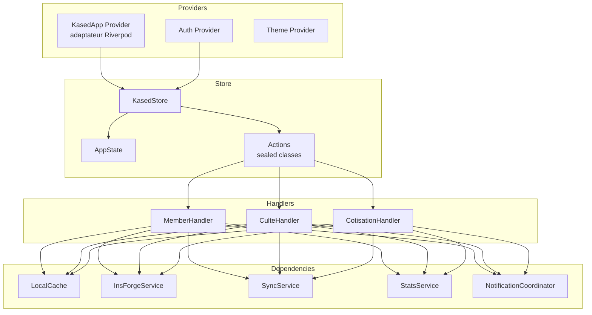
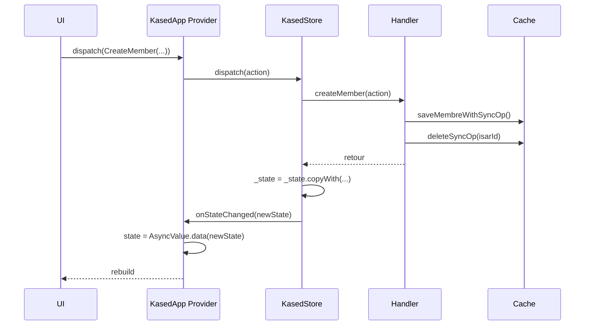

# State Management

Architecture Riverpod 2.6 de Kased App — KasedStore, actions, handlers.

## Aperçu



## KasedApp Provider — L'Adaptateur

**Fichier :** `lib/providers/kased_app_provider.dart`

Le provider est un adaptateur fin (~80 lignes) qui connecte le store au cycle de vie Flutter.

```dart
@Riverpod(keepAlive: true)
class KasedApp extends _$KasedApp {
  late KasedStore _store;
  StreamSubscription? _connectivitySubscription;

  @override
  FutureOr<AppState> build() async {
    // 1. Initialiser les dépendances
    final api = ref.watch(insForgeServiceProvider);
    final isar = await ref.watch(isarProvider.future);
    final cache = IsarLocalCache(isar);
    final syncService = SyncService(api, cache);
    final statsService = StatsService();
    final notifCoordinator = NotificationCoordinator(...);

    // 2. Créer le store
    _store = KasedStore(
      api: api,
      cache: cache,
      syncService: syncService,
      statsService: statsService,
      deviceService: RealDeviceService(),
      notifCoordinator: notifCoordinator,
    );

    // 3. Charger l'état initial depuis Isar
    await _store.reloadFromCache();

    // 4. Connecter le callback de mise à jour UI
    _store.onStateChanged = (newState) {
      state = AsyncValue.data(newState);
    };

    // 5. Surveiller la connectivité
    _connectivitySubscription = Connectivity()
        .onConnectivityChanged
        .listen((results) {
      final isOffline = results.contains(ConnectivityResult.none);
      final current = state.value ?? AppState();
      state = AsyncValue.data(current.copyWith(isOffline: isOffline));
      if (!isOffline && syncService.shouldSync()) {
        _store.dispatch(SyncData());
      }
    });

    // 6. Connecter le temps réel
    final authState = ref.read(authProvider);
    if (authState.isAuthenticated) {
      _store.connectRealtime(
        token: authState.token!,
        email: authState.userEmail!,
      );
    }

    // 7. Sync différé de 3 secondes après le chargement
    Future.delayed(const Duration(seconds: 3), () {
      if (_store.state.isOffline == false) {
        _store.dispatch(SyncData());
      }
    });

    return _store.state;
  }

  // Méthodes déléguées
  Future<void> dispatch(KasedAction action) async {
    await _store.dispatch(action);
  }
}
```

### Pourquoi un Adaptateur ?

| Problème | Solution |
|----------|----------|
| Le store a besoin de dépendances complexes | Le provider les initialise |
| Le store doit notifier l'UI | Callback `onStateChanged` |
| Le store doit gérer la connectivité | StreamSubscription dans le provider |
| Le store doit gérer le realtime | `connectRealtime()` appelé depuis le provider |

## KasedStore — Le Moteur

**Fichier :** `lib/store/kased_store.dart`

```dart
class KasedStore {
  AppState _state = AppState();
  AppState get state => _state;

  // Dépendances
  final LocalCache cache;
  final InsForgeServicePort api;
  final SyncService syncService;
  final StatsService statsService;
  final DeviceServicePort deviceService;
  final NotificationCoordinator notifCoordinator;

  // Handlers
  late MemberHandler _memberHandler;
  late CulteHandler _culteHandler;
  late CotisationHandler _cotisationHandler;

  // Callback UI
  void Function(AppState newState)? onStateChanged;

  // Connexion temps réel
  RealtimeHandler? _realtimeHandler;
```

### Méthode `dispatch()`

```dart
Future<void> dispatch(KasedAction action) async {
  try {
    switch (action) {
      // Membres
      case CreateMember():
        await _memberHandler.createMember(action);
        final membres = await cache.getAllMembres();
        _state = _state.copyWith(membres: sortMembres(membres));
        onStateChanged?.call(_state);

      case UpdateMember():
        await _memberHandler.updateMember(action);
        // ...

      case DeleteMember():
        await _memberHandler.deleteMember(action);
        // ...

      // Cultes
      case CreateCulte():
        await _culteHandler.createCulte(action);
        // ...

      // Cotisations
      case RegisterPayment():
        await _cotisationHandler.registerPayment(action);
        // ...

      // Sync
      case SyncData():
        await _handleSyncData();
        onStateChanged?.call(_state);

      case LoadDashboard():
        await _handleLoadDashboard();
        onStateChanged?.call(_state);
    }
  } catch (e, stack) {
    debugPrint('[KasedStore] Error dispatching $action: $e\n$stack');
    _state = _state.copyWith(error: e.toString());
  }
}
```

**Pattern clé :** Après chaque action, l'état est mis à jour puis le callback `onStateChanged` est appelé pour propager le changement à l'UI via Riverpod.

## AppState — L'État Global

**Fichier :** `lib/store/app_state.dart`

```dart
class AppState {
  final List<Membre> membres;
  final List<Culte> cultes;
  final List<Cotisation> cotisations;
  final Map<String, dynamic>? dashboard;
  final List<Map<String, dynamic>> retardsMembres;
  final List<Map<String, dynamic>> membresAJour;
  final List<Map<String, dynamic>> historiqueMembre;
  final String? historiqueMembreId;
  final bool isLoading;
  final bool isOffline;
  final String? error;

  AppState({
    this.membres = const [],
    this.cultes = const [],
    this.cotisations = const [],
    this.dashboard,
    this.retardsMembres = const [],
    this.membresAJour = const [],
    this.historiqueMembre = const [],
    this.historiqueMembreId,
    this.isLoading = false,
    this.isOffline = false,
    this.error,
  });

  AppState copyWith({...}) {
    return AppState(
      membres: membres ?? this.membres,
      // ...
    );
  }
}
```

### Pourquoi Immutable ?

`AppState` est immutable — chaque mutation crée une nouvelle instance via `copyWith`. Cela garantit que :
1. Les changements sont traçables
2. Les widgets se rebuildent correctement (Riverpod détecte le changement d'objet)
3. Pas de effets de bord accidentels

## Hiérarchie des Actions

**Fichier :** `lib/store/kased_action.dart`

Les actions utilisent les **sealed classes** de Dart 3 pour un typage exhaustif :

```dart
sealed class KasedAction {}

// Membres
sealed class MemberAction extends KasedAction {}
class CreateMember extends MemberAction {
  final String nom, prenom;
  final DateTime dateAdhesion;
  final DateTime? dateNaissance;
  final String? telephone, notes;
  // ...
}
class UpdateMember extends MemberAction { ... }
class DeleteMember extends MemberAction { ... }

// Cultes
sealed class CulteAction extends KasedAction {}
class CreateCulte extends CulteAction { ... }
class UpdateCulte extends CulteAction { ... }
class DeleteCulte extends CulteAction { ... }

// Cotisations
sealed class CotisationAction extends KasedAction {}
class RegisterPayment extends CotisationAction { ... }
class MarkAbsent extends CotisationAction { ... }
class BulkSetPaiements extends CotisationAction { ... }

// Sync
sealed class SyncAction extends KasedAction {}
class SyncData extends SyncAction {}
class LoadDashboard extends SyncAction {}

// Corbeille
sealed class CorbeilleAction extends KasedAction {}
class PermanentlyDelete extends CorbeilleAction { ... }
class EmptyTrash extends CorbeilleAction {}
```

**Avantage :** Le `switch` dans `dispatch()` est exhaustif — si on ajoute une nouvelle action, le compilateur exige de la gérer.

## Handlers — Logique Métier

### MemberHandler

**Fichier :** `lib/store/handlers/member_handler.dart`

```dart
class MemberHandler {
  final LocalCache cache;
  final InsForgeServicePort api;
  final DeviceServicePort deviceService;
  final NotificationCoordinator notifCoordinator;
  final Future<void> Function() onLoadDashboard;
  final Future<void> Function(String event, String label, {String? extra}) onPush;

  Future<void> createMember(CreateMember action) async {
    // 1. Générer UUID et préparer l'entité
    final newMembre = Membre()
      ..id = UuidUtils.generate()
      ..nom = action.nom
      ..prenom = action.prenom
      // ...

    // 2. Créer l'opération de sync
    final syncOp = SyncOperation()
      ..type = 'CREATE'
      ..entityType = 'membre'
      ..entityId = newMembre.id
      ..payloadJson = jsonEncode(newMembre.toJson())
      // ...

    // 3. Sauvegarder localement (Isar + op sync)
    await cache.saveMembreWithSyncOp(newMembre, syncOp);

    // 4. Appeler l'API (avec gestion d'erreur)
    try {
      await api.createMembre(newMembre.toJson());
      await cache.deleteSyncOp(syncOp.isarId); // Bug fix: supprimer l'op si succès
    } catch (e) {
      debugPrint('[MemberHandler] createMembre réseau échoué: $e');
      // L'op reste en file pour le prochain sync
    }

    // 5. Notifications
    notifCoordinator.notifierCreationMembreFull(newMembre);
    unawaited(onPush('membre_ajoute', newMembre.nomComplet));
  }
```

### CotisationHandler

**Fichier :** `lib/store/handlers/cotisation_handler.dart`

```dart
class CotisationHandler {
  // ...
  
  Future<void> registerPayment(RegisterPayment action) async {
    // 1. Récupérer le culte et les cotisations existantes
    final culte = (await cache.getAllCultes()).firstWhere(...);
    final cotisations = await onGetCotisations();
    
    // 2. Vérifier le verrouillage (30 jours)
    final isOlderThan30Days = DateTime.now().difference(culte.dateCulte).inDays > 30;
    if (isOlderThan30Days && existingCotisation.estPaye) {
      throw Exception('Le paiement est verrouillé après 30 jours.');
    }
    
    // 3. Déterminer le statut (en avance ou pas)
    final statut = CotisationLogic.determinerStatut(
      datePaiement: datePaiement,
      dateCulte: culte.dateCulte,
    );
    
    // 4. Mettre à jour localement
    await cache.saveCotisation(updatedCotisation);
    
    // 5. Consommer l'avance si nécessaire
    if (montantDon == 0 && membre.montantEnAvance >= action.montant) {
      await api.consommerAvancePourCulte(membreId: membre.id, culteId: action.culteId);
    }
  }
```

### CulteHandler

**Fichier :** `lib/store/handlers/culte_handler.dart`

```dart
class CulteHandler {
  Future<void> createCulte(CreateCulte action) async {
    // 1. Créer le culte
    final newCulte = Culte()
      ..id = UuidUtils.generate()
      ..dateCulte = action.date
      ..montantCotisation = action.montant;

    // 2. Sauvegarder + sync op
    await cache.saveCulteWithSyncOp(newCulte, syncOp);

    // 3. Appeler l'API
    try {
      await api.createCulte(newCulte.toJson());
      await cache.deleteSyncOp(syncOp.isarId);
    } catch (e) {
      debugPrint('[CulteHandler] createCulte réseau échoué: $e');
    }

    // 4. Notifications
    notifCoordinator.notifierCreationCulteFull(newCulte);
    await onLoadDashboard();
  }
```

## Cycle de Vie du State



## Tests des Handlers

Chaque handler est testable unitairement sans Flutter :

```dart
// Test d'un handler avec des mocks
final fakeCache = FakeLocalCache();
final fakeApi = FakeInsForgeService();
final fakeDeviceService = FakeDeviceService(deviceId: 'test-device');
final notifCoordinator = NotificationCoordinator();

final handler = MemberHandler(
  cache: fakeCache,
  api: fakeApi,
  deviceService: fakeDeviceService,
  notifCoordinator: notifCoordinator,
  onLoadDashboard: () async {},
  onPush: (_, __) async {},
);

test('createMember should save to cache and call API', () async {
  await handler.createMember(CreateMember(
    nom: 'Dupont',
    prenom: 'Jean',
    dateAdhesion: DateTime.now(),
  ));
  
  expect(fakeCache.savedMembres.length, 1);
  expect(fakeApi.createdMembres.length, 1);
});
```

## Voir Aussi

- [Architecture](Architecture) — Vue d'ensemble
- [Data Models](Data-Models) — Schéma des entités
- [Offline-First Sync](Offline-First-Sync) — Comment les ops sync sont gérées
- [Testing](Testing) — Stratégie de tests
