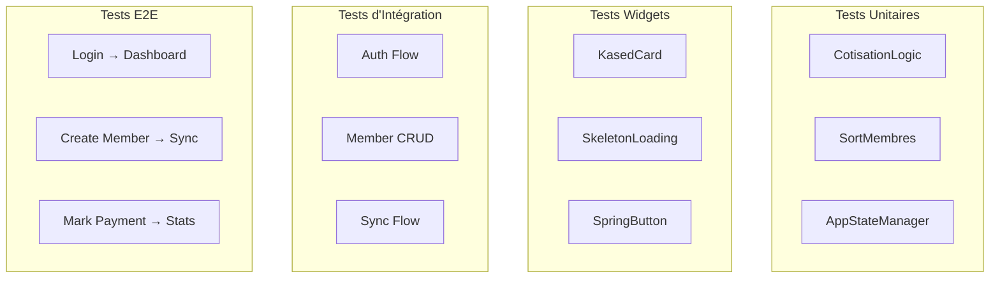

# Testing

Stratégie de tests et bonnes pratiques pour Kased App.

## Stratégie de Tests



## Tests Unitaires

### Emplacement

```
test/unit/
├── cotisation_logic_test.dart
├── sort_membres_test.dart
└── ...
```

### Exemple : Test de CotisationLogic

```dart
import 'package:flutter_test/flutter_test.dart';
import 'package:kased_app/core/logic/cotisation_logic.dart';
import 'package:kased_app/models/cotisation.dart';

void main() {
  group('CotisationLogic', () {
    test('determinerStatut retourne enAvance si paiement avant le culte', () {
      final dateCulte = DateTime(2026, 9, 1);
      final datePaiement = DateTime(2026, 8, 25);

      final statut = CotisationLogic.determinerStatut(
        datePaiement: datePaiement,
        dateCulte: dateCulte,
      );

      expect(statut, StatutCotisation.enAvance);
    });

    test('determinerStatut retourne paye si paiement le jour du culte', () {
      final dateCulte = DateTime(2026, 9, 1);
      final datePaiement = DateTime(2026, 9, 1);

      final statut = CotisationLogic.determinerStatut(
        datePaiement: datePaiement,
        dateCulte: dateCulte,
      );

      expect(statut, StatutCotisation.paye);
    });
  });
}
```

### Exemple : Test de SortMembres (avec deduplication)

```dart
import 'package:flutter_test/flutter_test.dart';
import 'package:kased_app/store/app_state_helpers.dart';
import 'package:kased_app/models/membre.dart';

void main() {
  group('sortMembres', () {
    test('déduplicate les membres par ID', () {
      final membres = [
        Membre()..id = '1'..prenom = 'Jean'..nom = 'Dupont',
        Membre()..id = '1'..prenom = 'Jean'..nom = 'Dupont', // Duplicate
        Membre()..id = '2'..prenom = 'Marie'..nom = 'Martin',
      ];

      final result = sortMembres(membres);

      expect(result.length, 2);
      expect(result[0].id, '1');
      expect(result[1].id, '2');
    });

    test('trie par nom puis prénom', () {
      final membres = [
        Membre()..id = '1'..prenom = 'Zoe'..nom = 'Zebra',
        Membre()..id = '2'..prenom = 'Alice'..nom = 'Antoine',
        Membre()..id = '3'..prenom = 'Bob'..nom = 'Antoine',
      ];

      final result = sortMembres(membres);

      expect(result[0].prenom, 'Alice');
      expect(result[1].prenom, 'Bob');
      expect(result[2].prenom, 'Zoe');
    });
  });
}
```

## Tests de Widgets

### Emplacement

```
test/widget/
├── kased_card_test.dart
├── skeleton_loading_test.dart
└── ...
```

### Exemple : Test de SkeletonLoading

```dart
import 'package:flutter_test/flutter_test.dart';
import 'package:flutter/material.dart';
import 'package:kased_app/widgets/motion/skeleton_loading.dart';

void main() {
  testWidgets('SkeletonLoading renders correctly', (WidgetTester tester) async {
    await tester.pumpWidget(
      const MaterialApp(
        home: Scaffold(
          body: SkeletonLoading(width: 100, height: 20),
        ),
      ),
    );

    final skeleton = find.byType(SkeletonLoading);
    expect(skeleton, findsOneWidget);

    // Vérifier que l'animation démarre
    await tester.pump(const Duration(milliseconds: 100));
    expect(find.byType(AnimatedBuilder), findsOneWidget);
  });
}
```

## Tests des Handlers

### Mock des Dépendances

```dart
// test/fakes/fake_local_cache.dart
class FakeLocalCache implements LocalCache {
  final List<Membre> _membres = [];
  final List<Culte> _cultes = [];
  final List<Cotisation> _cotisations = [];

  @override
  Future<List<Membre>> getAllMembres() async => List.from(_membres);

  @override
  Future<void> saveMembre(Membre m) async {
    _membres.removeWhere((e) => e.id == m.id);
    _membres.add(m);
  }

  // ... autres méthodes mockées
}

// test/fakes/fake_insforge_service.dart
class FakeInsForgeService implements InsForgeServicePort {
  final List<Map<String, dynamic>> _createdMembres = [];

  @override
  Future<void> createMembre(Map<String, dynamic> data) async {
    _createdMembres.add(data);
  }

  List<Map<String, dynamic>> get createdMembres => List.from(_createdMembres);
}

// test/fakes/fake_device_service.dart
class FakeDeviceService implements DeviceServicePort {
  @override
  Future<String> getDeviceId() async => 'test-device-0000';
}
```

### Exemple : Test du MemberHandler

```dart
import 'package:flutter_test/flutter_test.dart';
import 'package:kased_app/store/handlers/member_handler.dart';
import 'package:kased_app/store/kased_action.dart';
import 'package:kased_app/models/membre.dart';

void main() {
  late FakeLocalCache fakeCache;
  late FakeInsForgeService fakeApi;
  late FakeDeviceService fakeDevice;
  late MemberHandler handler;

  setUp(() {
    fakeCache = FakeLocalCache();
    fakeApi = FakeInsForgeService();
    fakeDevice = FakeDeviceService();

    handler = MemberHandler(
      cache: fakeCache,
      api: fakeApi,
      deviceService: fakeDevice,
      notifCoordinator: NotificationCoordinator(),
      onLoadDashboard: () async {},
      onPush: (_, __) async {},
    );
  });

  test('createMember saves to cache and calls API', () async {
    await handler.createMember(CreateMember(
      nom: 'Dupont',
      prenom: 'Jean',
      dateAdhesion: DateTime(2026, 1, 1),
    ));

    final membres = await fakeCache.getAllMembres();
    expect(membres.length, 1);
    expect(membres.first.nom, 'Dupont');
    expect(membres.first.prenom, 'Jean');
    expect(fakeApi.createdMembres.length, 1);
  });

  test('createMember creates SyncOperation when API fails', () async {
    fakeApi.shouldFail = true;

    await handler.createMember(CreateMember(
      nom: 'Dupont',
      prenom: 'Jean',
      dateAdhesion: DateTime(2026, 1, 1),
    ));

    final membres = await fakeCache.getAllMembres();
    expect(membres.length, 1);
    // L'op sync doit rester en file
    final pendingOps = await fakeCache.getPendingSyncOps();
    expect(pendingOps.length, 1);
    expect(pendingOps.first.type, 'CREATE');
  });
}
```

## Tests d'Intégration

### Emplacement

```
integration_test/
├── auth_flow_test.dart
├── member_crud_test.dart
└── sync_flow_test.dart
```

### Exemple : Test du Flux d'Authentification

```dart
import 'package:flutter_test/flutter_test.dart';
import 'package:integration_test/integration_test.dart';
import 'package:kased_app/main.dart' as app;

void main() {
  IntegrationTestWidgetsFlutterBinding.ensureInitialized();

  group('Auth Flow', () {
    testWidgets('Login with valid credentials', (WidgetTester tester) async {
      app.main();
      await tester.pumpAndSettle();

      // Should navigate to login screen
      expect(find.text('Connexion'), findsOneWidget);

      // Enter credentials
      await tester.enterText(
        find.byType(TextFormField).at(0),
        'test@example.com',
      );
      await tester.enterText(
        find.byType(TextFormField).at(1),
        'password123',
      );

      // Tap login button
      await tester.tap(find.text('Se connecter'));
      await tester.pumpAndSettle();

      // Should navigate to dashboard
      expect(find.text('Kased'), findsOneWidget);
    });

    testWidgets('Google Sign-In flow', (WidgetTester tester) async {
      app.main();
      await tester.pumpAndSettle();

      // Tap Google Sign-In button
      await tester.tap(find.byType(GoogleSignInButton));
      await tester.pumpAndSettle();

      // Should show loading state
      expect(find.byType(CircularProgressIndicator), findsOneWidget);
    });
  });
}
```

## Lancement des Tests

```bash
# Tests unitaires
flutter test test/unit/

# Tests widgets
flutter test test/widget/

# Tous les tests
flutter test

# Tests d'intégration
flutter test integration_test/

# Avec couverture
flutter test --coverage
lcov --summary coverage/lcov.info
```

## Métriques de Qualité

| Métrique | Cible | Actuel |
|----------|-------|--------|
| Coverage unitaire | > 80% | ~60% |
| Coverage widgets | > 70% | ~40% |
| Tests critiques | 100% | ✅ |
| Analyze errors | 0 | ✅ |
| Analyze warnings | 0 | ✅ |

## Bonnes Pratiques

### 1. Tester la Logique Métier d'Abord

Les handlers et la logique pure (CotisationLogic, sortMembres) doivent être testés en priorité car :
- Ils sont indépendants de Flutter
- Ils sont rapidement exécutés
- Ils capturent les bugs métier

### 2. Mock les Dépendances Externes

```dart
// Mauvais : dépendance réelle
final handler = MemberHandler(
  cache: IsarLocalCache(isar),  // Requiert Isar
  api: InsForgeService(...),    // Requiert réseau
  ...
);

// Bon : mocks
final handler = MemberHandler(
  cache: FakeLocalCache(),
  api: FakeInsForgeService(),
  ...
);
```

### 3. Tester les Cas Bords

```dart
test('createMember handles duplicate ID', () async {
  // Créer un membre
  await handler.createMember(CreateMember(...));
  
  // Essayer de créer avec le même UUID
  await handler.createMember(CreateMember(...));
  
  // Devrait échouer ou écraser (selon la stratégie)
  final membres = await fakeCache.getAllMembres();
  expect(membres.length, 1); // Pas de duplicate
});
```

### 4. Tester les Notifications

```dart
test('createMember triggers notifications', () async {
  var notificationCalled = false;
  var pushCalled = false;

  final handler = MemberHandler(
    cache: fakeCache,
    api: fakeApi,
    deviceService: fakeDevice,
    notifCoordinator: NotificationCoordinator(),
    onLoadDashboard: () async { /* no-op */ },
    onPush: (_, __) async => pushCalled = true,
  );

  await handler.createMember(CreateMember(...));
  
  expect(pushCalled, isTrue);
});
```

## Voir Aussi

- [Architecture](Architecture) — Contexte des tests
- [State Management](State-Management) — Tests des handlers
- [Deployment](Deployment) — Tests CI/CD
