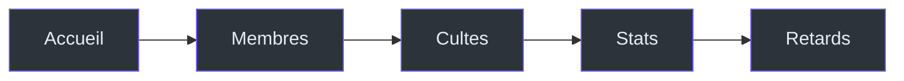

# UI/UX

Design system et interface utilisateur de Kased App.

## Design System

### Couleurs

**Fichier :** `lib/core/theme/app_theme.dart`

| Rôle | Light | Dark | Usage |
|------|-------|------|-------|
| `primary` | `#2962FF` | `#2979FF` | Boutons, actions principales |
| `background` | `#F8F9FE` | `#0B0F19` | Fond de l'écran |
| `surface` | `#FFFFFF` | `#131A2A` | Cartes, containers |
| `surface2` | `#F0F4F8` | `#1E293B` | Sous-containers |
| `border` | `#E2E8F0` | `#334155` | Bordures |
| `textPrimary` | `#0F172A` | `#F8FAFC` | Texte principal |
| `textSecondary` | `#64748B` | `#94A3B8` | Texte secondaire |
| `error` | `#FF1744` | `#FF1744` | Erreurs, suppressions |
| `success` | `#00C853` | `#00C853` | Succès, paiements |

### Typographie

| Élément | Police | Weight | Size |
|---------|--------|--------|------|
| Titres | Syne | 700-800 | 22-57px |
| Corps | DM Sans | 400-600 | 11-16px |
| Labels | DM Sans | 500-600 | 11-14px |

```dart
// lib/core/theme/app_theme.dart
static TextStyle _displayStyle(double fontSize, {FontWeight fontWeight = FontWeight.w700, ...}) {
  return GoogleFonts.syne(fontSize: fontSize, fontWeight: fontWeight, ...);
}

static TextTheme get _lightTextTheme => GoogleFonts.dmSansTextTheme().copyWith(
  headlineLarge: _displayStyle(32, fontWeight: FontWeight.w800, color: AppColors.textPrimary),
  titleLarge: GoogleFonts.dmSans(fontSize: 22, fontWeight: FontWeight.w700, color: AppColors.textPrimary),
  bodyLarge: GoogleFonts.dmSans(fontSize: 16, color: AppColors.textPrimary),
  // ...
);
```

## Navigation

### Bottom Navigation Bar

**Fichier :** `lib/widgets/app_shell.dart`

```dart
// 5 destinations
NavigationBar(
  destinations: [
    NavigationDestination(icon: Icons.home, label: 'Accueil'),
    NavigationDestination(icon: Icons.people, label: 'Membres'),
    NavigationDestination(icon: Icons.church, label: 'Cultes'),
    NavigationDestination(icon: Icons.bar_chart, label: 'Stats'),
    NavigationDestination(icon: Icons.warning_amber, label: 'Retards'),
  ],
)
```

**Design :**
- Glass-morphism (blur + transparency)
- Double shadow (floating effect)
- Badge animé sur "Retards" si > 0 membres en retard
- Spring animation sur les icônes



### Transitions de Pages

**Fichier :** `lib/core/router/app_router.dart:234-261`

```dart
CustomTransitionPage<void> _buildFadeSlidePage({...}) {
  return CustomTransitionPage<void>(
    key: state.pageKey,
    child: child,
    transitionsBuilder: (context, animation, secondaryAnimation, child) {
      return FadeTransition(
        opacity: animation,
        child: SlideTransition(
          position: Tween<Offset>(
            begin: const Offset(0.04, 0.0), // 4% horizontal translation
            end: Offset.zero,
          ).animate(CurvedAnimation(
            parent: animation,
            curve: Curves.easeOutCubic,
          )),
          child: child,
        ),
      );
    },
    transitionDuration: const Duration(milliseconds: 320),
  );
}
```

**Effet :** Fade + légère translation horizontale (4%) vers la gauche.

## Widgets Réutilisables

### KasedCard

**Fichier :** `lib/widgets/kased_card.dart`

```dart
class KasedCard extends StatelessWidget {
  final Widget child;
  final VoidCallback? onTap;
  final Color? color;
  final BorderRadius? borderRadius;

  const KasedCard({
    super.key,
    required this.child,
    this.onTap,
    this.color,
    this.borderRadius,
  });

  @override
  Widget build(BuildContext context) {
    return GestureDetector(
      onTap: onTap,
      child: Container(
        decoration: BoxDecoration(
          color: color ?? Theme.of(context).colorScheme.surface,
          borderRadius: borderRadius ?? BorderRadius.circular(24),
          border: Border.all(
            color: Theme.of(context).colorScheme.outline.withValues(alpha: 0.5),
          ),
          boxShadow: [
            BoxShadow(
              color: Colors.black.withValues(alpha: 0.05),
              blurRadius: 12,
              offset: const Offset(0, 4),
            ),
          ],
        ),
        child: child,
      ),
    );
  }
}
```

### KasedAvatar

**Fichier :** `lib/widgets/kased_avatar.dart`

```dart
class KasedAvatar extends StatelessWidget {
  final String initials;
  final double size;
  final String? imagePath;

  const KasedAvatar({
    super.key,
    required this.initials,
    this.size = 40,
    this.imagePath,
  });

  @override
  Widget build(BuildContext context) {
    return CircleAvatar(
      radius: size / 2,
      backgroundColor: const Color(0xFF2962FF),
      child: imagePath != null
          ? ClipOval(child: Image.network(imagePath!, width: size, height: size, fit: BoxFit.cover))
          : Text(
              initials,
              style: TextStyle(
                color: Colors.white,
                fontSize: size * 0.4,
                fontWeight: FontWeight.bold,
              ),
            ),
    );
  }
}
```

### SkeletonLoading (Shimmer)

**Fichier :** `lib/widgets/motion/skeleton_loading.dart`

```dart
class SkeletonLoading extends StatefulWidget {
  final double width;
  final double height;
  final BorderRadius? borderRadius;

  const SkeletonLoading({
    super.key,
    required this.width,
    required this.height,
    this.borderRadius,
  });

  @override
  State<SkeletonLoading> createState() => _SkeletonLoadingState();
}

class _SkeletonLoadingState extends State<SkeletonLoading>
    with SingleTickerProviderStateMixin {
  late AnimationController _controller;
  late Animation<double> _animation;

  @override
  void initState() {
    super.initState();
    _controller = AnimationController(
      vsync: this,
      duration: const Duration(seconds: 3), // Shimmer lent et visible
    )..repeat();

    _animation = Tween<double>(begin: -2.0, end: 2.0).animate(
      CurvedAnimation(parent: _controller, curve: Curves.linear),
    );
  }

  @override
  Widget build(BuildContext context) {
    final isDark = Theme.of(context).brightness == Brightness.dark;
    final baseColor = isDark ? const Color(0xFF1E293B) : const Color(0xFFE2E8F0);
    final highlightColor = isDark ? const Color(0xFF475569) : const Color(0xFFFFFFFF);

    return AnimatedBuilder(
      animation: _animation,
      builder: (context, child) {
        return Container(
          width: widget.width,
          height: widget.height,
          decoration: BoxDecoration(
            borderRadius: widget.borderRadius ?? BorderRadius.circular(8),
            gradient: LinearGradient(
              begin: Alignment.topLeft,
              end: Alignment.bottomRight,
              colors: [baseColor, highlightColor, baseColor],
              stops: [0.0, 0.5 + (_animation.value / 4), 1.0],
            ),
          ),
        );
      },
    );
  }
}
```

**Versions pré-existants :**
- `DashboardSkeleton` — Skeleton pour l'écran d'accueil
- `MembresListSkeleton` — Skeleton pour la liste des membres
- `CulteDetailSkeleton` — Skeleton pour le détail d'un culte

### SpringButton

**Fichier :** `lib/widgets/spring_button.dart`

```dart
class SpringButton extends StatefulWidget {
  final Widget child;
  final VoidCallback onTap;

  const SpringButton({super.key, required this.child, required this.onTap});

  @override
  State<SpringButton> createState() => _SpringButtonState();
}

class _SpringButtonState extends State<SpringButton>
    with SingleTickerProviderStateMixin {
  late AnimationController _controller;
  late Animation<double> _scaleAnimation;

  @override
  void initState() {
    super.initState();
    _controller = AnimationController(
      vsync: this,
      duration: const Duration(milliseconds: 150),
      reverseDuration: const Duration(milliseconds: 300),
    );
    _scaleAnimation = Tween<double>(begin: 1.0, end: 0.92).animate(
      CurvedAnimation(parent: _controller, curve: Curves.easeInOut),
    );
  }

  @override
  void dispose() {
    _controller.dispose();
    super.dispose();
  }

  @override
  Widget build(BuildContext context) {
    return GestureDetector(
      onTapDown: (_) => _controller.forward(),
      onTapUp: (_) {
        _controller.reverse();
        widget.onTap();
      },
      onTapCancel: () => _controller.reverse(),
      child: ScaleTransition(
        scale: _scaleAnimation,
        child: widget.child,
      ),
    );
  }
}
```

**Effet :** Compression au tap (0.92x) avec restitution spring.

## Thème Material 3

**Fichier :** `lib/core/theme/app_theme.dart`

```dart
class AppTheme {
  static ThemeData get light => _buildTheme(Brightness.light);
  static ThemeData get dark => _buildTheme(Brightness.dark);

  static ThemeData _buildTheme(Brightness brightness) {
    final isDark = brightness == Brightness.dark;
    final scheme = isDark ? _darkScheme : _lightScheme;
    final textTheme = isDark ? _darkTextTheme : _lightTextTheme;

    return ThemeData(
      useMaterial3: true,
      brightness: brightness,
      colorScheme: scheme,
      scaffoldBackgroundColor: scheme.surface,
      textTheme: textTheme,
      appBarTheme: AppBarTheme(
        backgroundColor: isDark ? scheme.surface : AppColors.primary,
        foregroundColor: scheme.onSurface,
        elevation: 0,
        centerTitle: false,
      ),
      cardTheme: CardThemeData(
        elevation: 0,
        color: scheme.surface,
        margin: EdgeInsets.zero,
        shape: RoundedRectangleBorder(
          borderRadius: BorderRadius.circular(24),
        ),
      ),
      elevatedButtonTheme: ElevatedButtonThemeData(
        style: ElevatedButton.styleFrom(
          backgroundColor: scheme.primary,
          elevation: 4,
          shadowColor: scheme.primary.withValues(alpha: 0.4),
          minimumSize: const Size(0, 52),
          padding: const EdgeInsets.symmetric(horizontal: 24, vertical: 16),
          shape: RoundedRectangleBorder(
            borderRadius: BorderRadius.circular(16),
          ),
        ),
      ),
      // ...
    );
  }
}
```

## Animations

### SpringNavIcon

**Fichier :** `lib/widgets/spring_nav_icon.dart`

Icône de navigation avec animation spring au changement d'état.

```dart
class SpringNavIcon extends StatefulWidget {
  final IconData icon;
  final IconData selectedIcon;
  final bool isSelected;
  final String label;
  final Color selectedColor;
  final Color unselectedColor;

  const SpringNavIcon({...});

  @override
  State<SpringNavIcon> createState() => _SpringNavIconState();
}

class _SpringNavIconState extends State<SpringNavIcon>
    with SingleTickerProviderStateMixin {
  late AnimationController _controller;
  late Animation<double> _scaleAnimation;

  @override
  void initState() {
    super.initState();
    _controller = AnimationController(
      vsync: this,
      duration: const Duration(milliseconds: 300),
      reverseDuration: const Duration(milliseconds: 400),
    );
    _scaleAnimation = Tween<double>(begin: 1.0, end: 1.3).animate(
      CurvedAnimation(parent: _controller, curve: Curves.easeOutBack),
    );
  }

  @override
  void didUpdateWidget(SpringNavIcon oldWidget) {
    super.didUpdateWidget(oldWidget);
    if (widget.isSelected != oldWidget.isSelected) {
      if (widget.isSelected) {
        _controller.forward();
      } else {
        _controller.reverse();
      }
    }
  }

  @override
  Widget build(BuildContext context) {
    return ScaleTransition(
      scale: _scaleAnimation,
      child: Icon(
        widget.isSelected ? widget.selectedIcon : widget.icon,
        color: widget.isSelected ? widget.selectedColor : widget.unselectedColor,
      ),
    );
  }
}
```

### AnimatedAppear

**Fichier :** `lib/widgets/motion/animated_appear.dart`

Animation d'apparition (fade + slide) pour les listes.

```dart
class AnimatedAppear extends StatefulWidget {
  final Widget child;
  final Duration delay;

  const AnimatedAppear({super.key, required this.child, this.delay = Duration.zero});

  @override
  State<AnimatedAppear> createState() => _AnimatedAppearState();
}

class _AnimatedAppearState extends State<AnimatedAppear>
    with SingleTickerProviderStateMixin {
  late AnimationController _controller;
  late Animation<double> _opacityAnimation;
  late Animation<Offset> _slideAnimation;

  @override
  void initState() {
    super.initState();
    _controller = AnimationController(
      vsync: this,
      duration: const Duration(milliseconds: 400),
    );
    _opacityAnimation = Tween<double>(begin: 0.0, end: 1.0).animate(
      CurvedAnimation(parent: _controller, curve: Curves.easeOut),
    );
    _slideAnimation = Tween<Offset>(
      begin: const Offset(0.0, 0.05),
      end: Offset.zero,
    ).animate(CurvedAnimation(parent: _controller, curve: Curves.easeOutCubic));

    Future.delayed(widget.delay, () {
      if (mounted) _controller.forward();
    });
  }

  @override
  void dispose() {
    _controller.dispose();
    super.dispose();
  }

  @override
  Widget build(BuildContext context) {
    return FadeTransition(
      opacity: _opacityAnimation,
      child: SlideTransition(
        position: _slideAnimation,
        child: widget.child,
      ),
    );
  }
}
```

## Screen Layouts

### Dashboard

**Fichier :** `lib/screens/dashboard/dashboard_screen.dart`

```
┌─────────────────────────────────────────────────────────┐
│  [Menu]              Kased              [Corbeille]     │
├─────────────────────────────────────────────────────────┤
│                                                         │
│  ┌─────────────────────────────────────────────────┐   │
│  │  Bienvenue, [Nom]                                │   │
│  │  Prochain culte: [Date]                          │   │
│  └─────────────────────────────────────────────────┘   │
│                                                         │
│  ┌──────────┐ ┌──────────┐ ┌──────────┐ ┌──────────┐  │
│  │ Membres  │ │ Cultes   │ │ Collecte │ │ Retards  │  │
│  │   45     │ │   12     │ │  2.250.000│ │    8     │  │
│  └──────────┘ └──────────┘ └──────────┘ └──────────┘  │
│                                                         │
│  ┌─────────────────────────────────────────────────┐   │
│  │  Graphique des collectes (FL Chart)              │   │
│  └─────────────────────────────────────────────────┘   │
│                                                         │
│  ┌─────────────────────────────────────────────────┐   │
│  │  Cultes récents                                   │   │
│  │  • Culte du 29 août 2026                        │   │
│  │  • Culte du 22 août 2026                        │   │
│  └─────────────────────────────────────────────────┘   │
│                                                         │
├─────────────────────────────────────────────────────────┤
│  [Home] [People] [Church] [Chart] [Warning]            │
└─────────────────────────────────────────────────────────┘
```

## Voir Aussi

- [Architecture](Architecture) — Vue d'ensemble
- [State Management](State-Management) — Comment l'UI consomme le state
- [Testing](Testing) — Tests des widgets
- [Getting Started](Getting-Started) — Configuration du thème
